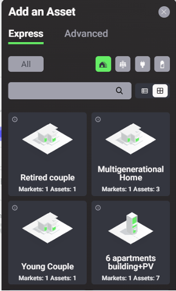
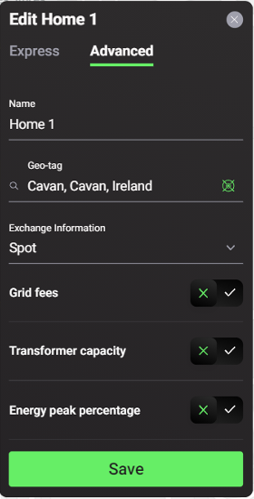

After clicking on the “Add a Home” button, users can add homes to represent households or other local energy market (LEM) participants /  community members by selecting one of the available template home types, or a custom home.

<figure markdown>
  {:style="height:500px;width:300px"; text-align:center"}
  <figcaption><b>Figure 2.7</b>: Build Community icon in the Grid Singularity Exchange web-based interface (Singularity Map).
</figcaption>
</figure>

The custom home has no assets included initially and it is suited for users who prefer to configure the home’s energy assets manually and/or upload their own energy data. The trading preferences for assets within the custom home can also be edited. The template homes, in turn, have preconfigured assets whose type and number can be seen in the individual listings. All template homes have at least one consumption (load) profile by default, while some others also have PV generation profiles (solar panels) or batteries (storage). For example, a “Retired couple” template home has one asset included (consumption profile), as shown in the figure below. The “6-apartments building + PV” template home has seven assets, including consumption profiles for each of the apartments and a shared PV generation profile. While template homes serve to quickly model an energy community, users can still add, remove or edit assets and their trade pricing preferences in the templates to assess the impact of different configurations.

The template homes have been created using data from [Load Profile Generator](https://www.loadprofilegenerator.de/){target=_blank} and [Energy Data Map](https://energydatamap.com/){target=_blank} to represent the typical consumption and generation for different types of LEM participants. Please note that while the energy production profiles generated from [Energy Data Map](https://mapped.energy/) are location-specific, the consumption profiles are randomly generated.

As a default setting, a home functions as a market, where multiple assets can trade with each other, as well as with assets in other homes.  An additional feature available in the backend is to group homes together to form a community which can trade with other communities.

##Home Configuration Options:

###Express Mode

1. Name: select a unique name for the home;
2. Location: the location selected by the user is automatically uploaded;
3. Preconfigured homes can be added from the template home library and then further edited based on user preferences (e.g. a shared battery can be added to a pre-configured 6-apartment building with one PV).

###Advanced Mode
In the advanced mode, the following settings are available

1. Exchange mechanism: select a [market types](market-types.md) for clearing bids and offers (note: at the moment only the spot market is available)
2. Grid fees: choose to switch on ✅ or off 🆇. If switched on, users can enter a [constant grid fee](grid-fee-accounting.md#constant-grid-fee-calculation) value expressed in cents/kWh (note: this value will then function as a fee that will be applied to each trade that passes through or is cleared in this market to account for grid cost)
3. Energy peak percentage: choose to switch on ✅ or off 🆇.  if switched on, set baseline peak import and export rates to calculate the [peak percentage](trade-profile.md)

<figure markdown>
  {:text-align:center"}
  <figcaption><b>Figure 2.8</b>: Advanced Home Configuration Options in the Grid Singularity Exchange web-based interface (Singularity Map)
</figcaption>
</figure>
