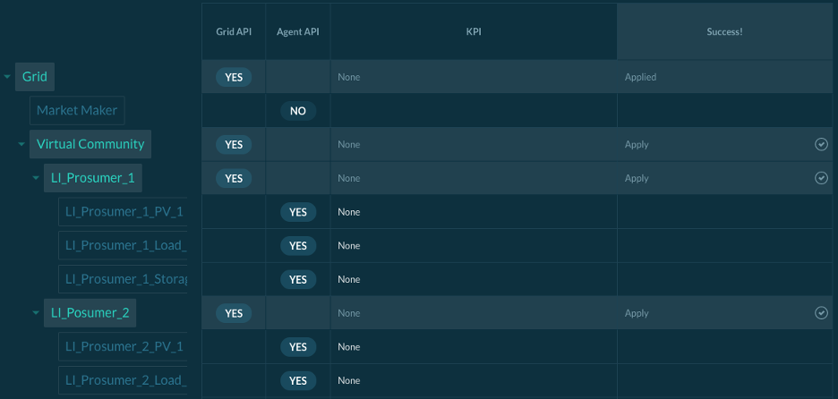
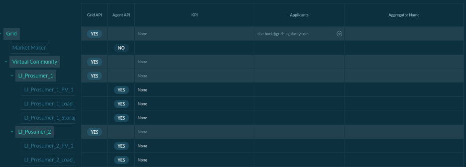

The Grid Singularity Grid Operator API is designed for grid operators (notably Distribution System Operators or DSOs) to manage congestion and grid constraints in different markets across the grid. The structure is designed so that multiple markets can be managed by a single agent (digital representation of the grid operator preferences), allowing information to be aggregated for integrated grid management.

It allows users to create agents that can dynamically change the grid fee in different markets. These agents can request and receive information through the Grid Operator API, feed that information into a tariff model, and submit grid fees through the Exchange SDK to change grid fees on the exchange.  For more information, see [this article](https://gridsingularity.medium.com/energy-singularity-challenge-2020-testing-novel-grid-fee-models-and-intelligent-peer-to-peer-6a0d715a9063){target=_blank}.

To actively manage grid congestion by sending new grid fees at every market slot for different markets at different levels of the grid, please follow the following steps:

* Install the Grid Singularity Exchange SDK on your computer by launching the following commands on your terminal window:

**Install gsy-e-sdk**

```
mkvirtualenv gsy-e-sdk
pip install https://github.com/gridsingularity/gsy-e-sdk.git
```
**Update gsy-e-sdk (needed when an update is deployed)**
```
pip uninstall -y gsy-e-sdk
pip install git+https://github.com/gridsingularity/gsy-e-sdk.git
```

**Install the following Python packages**
```
pip install pandas
pip install openpyxl
```

* Go to the *Registry and Scoreboard* section of the Collaboration of your interest and apply to every market that you wish to connect and to actively manage by sending new grid fees for each market slot. Then click on *Submit your actions*. If you have not already created a Collaboration / Canary Test Network, please follow instructions respectively [here](collaboration.md) or [here](connect-ctn.md) first.



* Notify Grid Singularity administration by sending an email to [contact@gridsingularity.com](mailto:contact@gridsingularity.com) to accept your applications) (note: this action will be automated in the future).



* Edit the [Grid Operator SDK Script template](https://github.com/gridsingularity/gsy-e-sdk/blob/master/gsy_e_sdk/setups/grid_operator_api_template.py){target=_blank} to experiment with different grid fee models.
* [Launch the Grid Operator SDK Script](registration-grid-operator-api-user-interface.md) to connect with the Grid Singularity Collaboration / Canary Test Network. A video tutorial is also available [here](https://www.youtube.com/watch?v=LoYoyIy-C7M){target=_blank}.
* Run the Collaboration or notify the collaboration owner that you are ready.
