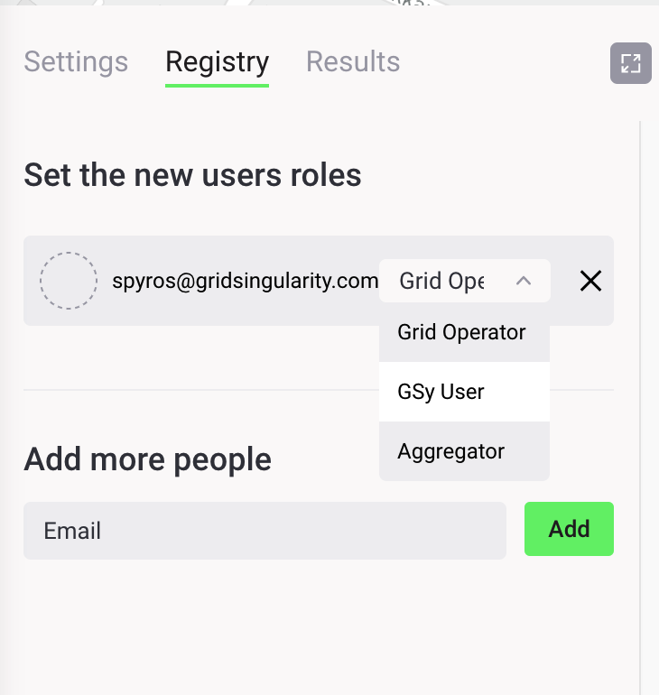

The Grid Singularity Grid Operator API is designed for grid operators (notably Distribution System Operators or DSOs) to manage congestion and grid constraints in different markets across the grid. The structure is designed so that multiple markets can be managed by a single agent (digital representation of the grid operator preferences), allowing information to be aggregated for integrated grid management.

It allows users to create agents that can dynamically change the grid fee in different markets. These agents can request and receive information through the Grid Operator API, feed that information into a tariff model, and submit grid fees through the Exchange SDK to change grid fees on the exchange.  For more information, see [this article](https://gridsingularity.medium.com/energy-singularity-challenge-2020-testing-novel-grid-fee-models-and-intelligent-peer-to-peer-6a0d715a9063){target=_blank}.

To actively manage grid congestion by applying different grid fees for each market slot for select markets at different levels of the grid, please follow the following steps:

First, please install the Grid Singularity Exchange SDK on your computer by launching the following commands on your terminal window:

**Install gsy-e-sdk**

```
mkvirtualenv gsy-e-sdk
pip install https://github.com/gridsingularity/gsy-e-sdk.git
```
**Update gsy-e-sdk (needed when an update is deployed)**
```
pip uninstall -y gsy-e-sdk
pip install git+https://github.com/gridsingularity/gsy-e-sdk.git
```

**Install the following Python packages**
```
pip install pandas
pip install openpyxl
```

1. For connecting to a specific Collaboration/Canary Network, the owner/Exchange Operator has to invite and grant access as Grid operator in the Registry panel:
   <figure markdown>
     {:style="height:340px;width:300px";text-align:center}
   </figure>
2. Edit the [Grid Operator SDK Script template](https://github.com/gridsingularity/gsy-e-sdk/blob/master/gsy_e_sdk/setups/grid_operator_api_scripts/rest_grid_fees.py){target=_blank} to experiment with different grid fee models and launch it.
3. Run the Collaboration or notify the [exchange operator](collaboration.md#exchange-operator) that you are ready.
