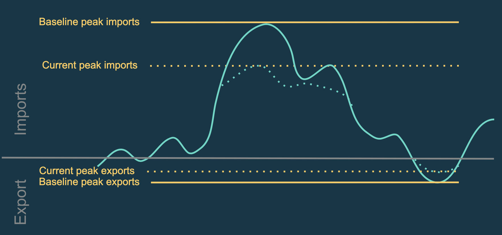

In the last few years, distributed energy resources concept has gained ground in the power utility scope. Strictly speaking in terms of D3A, it is necessary to know a metric that could aid in visualising local resource utilisation in distributed energy trading platform. In order to do so we have planned to implement some KPIs to give us a good figure of effectiveness of localised distributed energy trading.

### Self-Sufficiency & Self-Consumption

The **Self-Sufficiency** of an **area** is its **internal consumption** of energy (all energy consumed that was produced internally in the area) **as a fraction of it's demand** of energy (all energy demanded by the area).

The **Self-Consumption** of an **area** is its **internal consumption** of energy (all energy consumed that was produced internally in the area) **as a fraction of it's production** of energy (all energy produced by the area).

Strictly speaking in terms of formula:

- self_sufficiency(area) = self_consumed_energy / total_energy_demanded
- self_consumption(area) = self_consumed_energy / total_energy_produced

If you have a look at the hierarchical energy grid as shown in figure below, the self_consumed energy would be different from the reference point of whole energy grid. Lets consider **house 1** where,

- `total_house1_pv_production` = 10kWh

- `house1_pv` → `house1_load` = 1kWh

- `house1_pv` → `house1_storage` = 5kWh
- `house1_pv` → `house2_load` = 4kWh
- `house1_storage` → `house1_load` = 2kWh
- `house1_storage` → `house2_load` = 3kWh
- `house1_self_consumer_energy` = (`house1_pv` → `house1_load`) + (`house1_pv` → `house1_storage` → `house1_load`) = 1 + 2 = 3kWh
- `house1_total_energy_demanded` (only includes the demanded energy from house1’s load device) = 3kWh

Then, self-sufficiency of the house 1 is `self_sufficiency(house1) = house1_self_consumer_energy / house1_total_energy_demanded`

- `self_sufficiency(house1)` = 3 / 3 = 0.75 → 100% 

Then, self-consumption of the house 1 is `self_consumption(house1) = house1_self_consumer_energy / house1_total_energy_produced`

- `self_consumption(house1)` = 3 / 10 = 0.3 → 30%

From the reference point of **GRID** where all others areas are its children: 

- **self_sufficiency** = 10 / 10 = 1 → 100%

- **self_consumption** = 10 / 10 = 1 → 100%

### Peak percentage

An energy peak imports/exports is the maximum of the aggregate imports/exports of every nodes inside an area.
The user has the possibility to set a *baseline peak imports* and a *baseline peak exports* that he may have gotten from another simulation.

The peak percentage can be calculated as follow : 

* Energy_percentage_peak_imports = Current_peak_imports / Baseline_peak_imports * 100
* Energy_percentage_peak_exports = Current_peak_exports / Baseline_peak_exports * 100

