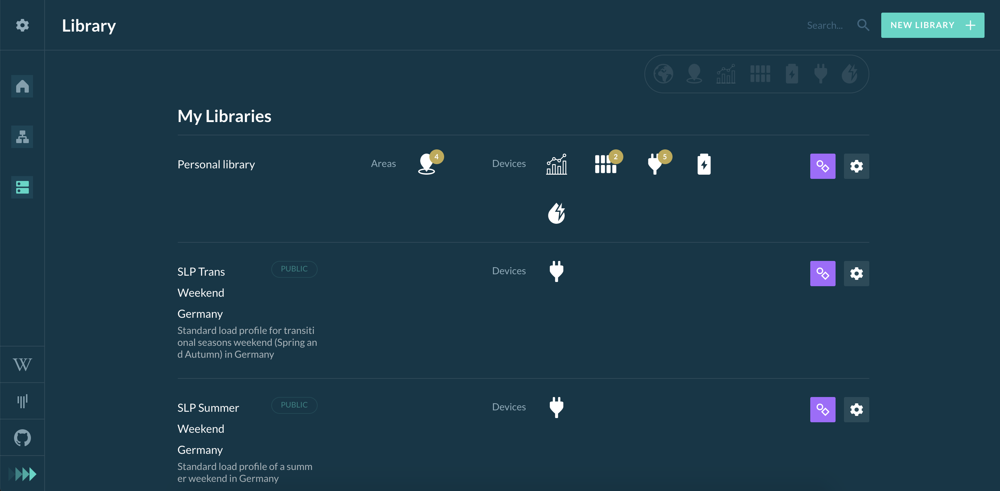

Libraries are pre-configured devices, Areas, and even small grids that can be reused in different simulations.

The List of libraries is paginated. 
You can either click through the pages by pressing the "Prev" or "Next" button on the bottom right corner or use the search field on the top right to filter the list by the library names.

**The following buttons and labels can be seen in the Library page:**  

Denotes public Libraries (other users can see the Library and the uploaded profiles):

{:style="height:40px;width:110px"} &  (in the search bar)

Quicklook labels for showing which kind of devices (and how many) are used in the library and whether they are areas:

{:style="height:50px;width:500px"}

With this button the user can edit the library (or view public libraries):

{:style="height:50px;width:50px"}

With this button the user can rename, duplicate or delete the library (only his own library):

{:style="height:50px;width:50px"}

The user can also create a new library (redirects to [Grid setup](grid-setup.md)):

