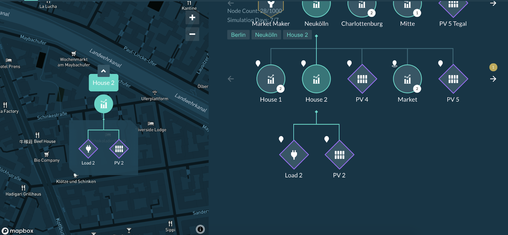
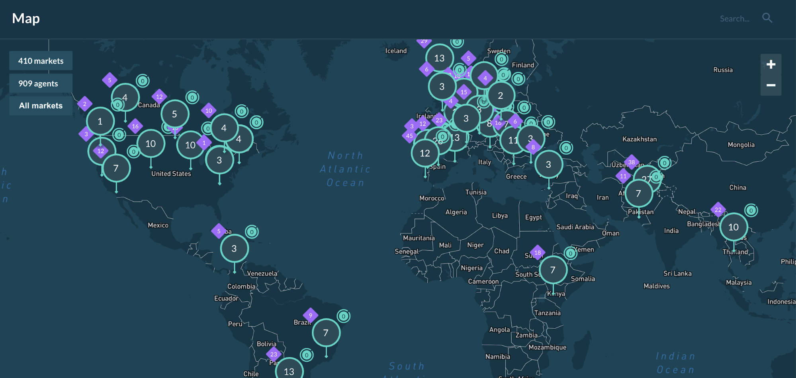

In the [User Interface](https://www.d3a.io/){target=_blank}, each energy asset and market can be pinned on a map with geographic coordinates in the form of a geotag, linked to a **physical address**. If a geotag is set at the market level, all submarkets and their assets are tied to these coordinates.

In this example, **Neuköln** market includes all submarkets and assets under the same geotag (House 1, House 2, PV 4, Market and PV 5).

If a market geo-tag type is set to **location**, the market can be pinned on the map and all of its submarkets and assets will inherit the same location:

In this example, House 2’s assets are assigned the same location as the House 2 submarket.

Once the user has added locations via geotags for its markets and energy assets, the simulation will be shown on the Grid Singularity’s public map, which will disclose the location of the simulation’s highest market and the total number of markets and energy assets.

For a video tutorial on the map feature, please follow this [link](https://youtu.be/2ylGNMjbhDY){target=_blank}.
