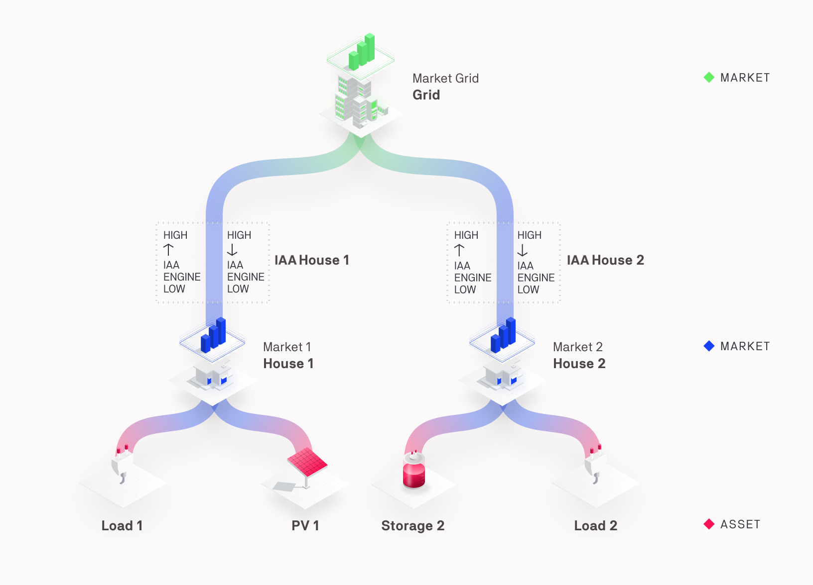

The MarketAgent (MA) plays a crucial role in the communication architecture of Grid Singularity’s exchange, allowing different markets in the hierarchy to interact and trade with each other. The MarketAgent is created for each market (households/buildings, streets, etc. that do not have preset trading strategies) and mainly deals with forwarding bids and offers markets of different hierarchy levels.

The following illustration shows a sample grid setup and the role of the MarketAgent in the market hierarchy during one time slot:

<figure markdown>
  {:text-align:center"}
  <figcaption><b>Figure 4.12</b>: The MarketAgent and bids / offers propagation in the Grid Singularity Exchange.
</figcaption>
</figure>

The MA is responsible for modelling hierarchical market operations, as follows:

*   **Forwarding** bids and offers from a lower hierarchy (market) to an upper hierarchy.
*   **Reacting** to bids, offers and trades reported by MAs in connected markets, in order to propagate the event for an offer/bid that has been forwarded from this MA.
*   Triggering the **matching** of bids and offers for the two-sided market.

To prioritize local trades, MAs forward bids and offers to higher/lower markets with a [two-tick](markets.md#market-ticks) delay.
