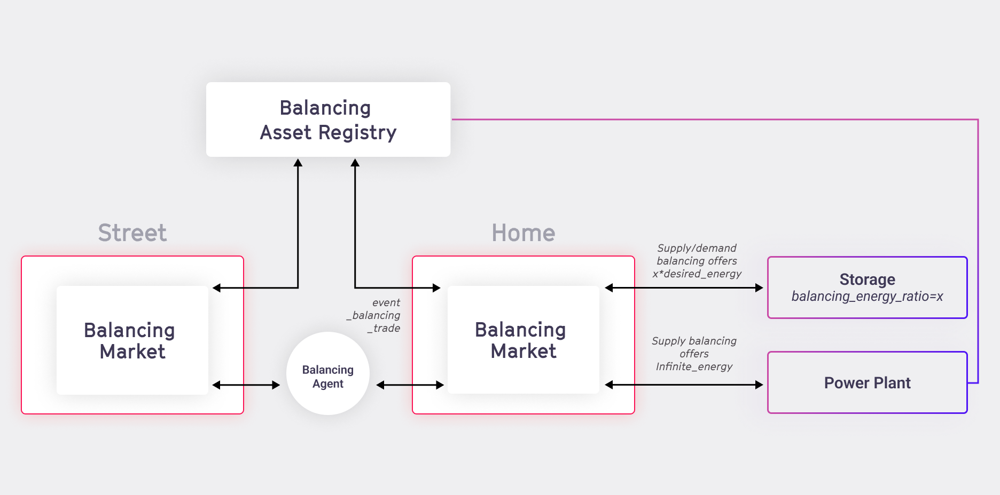
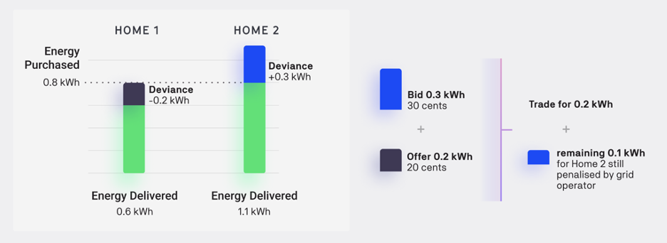
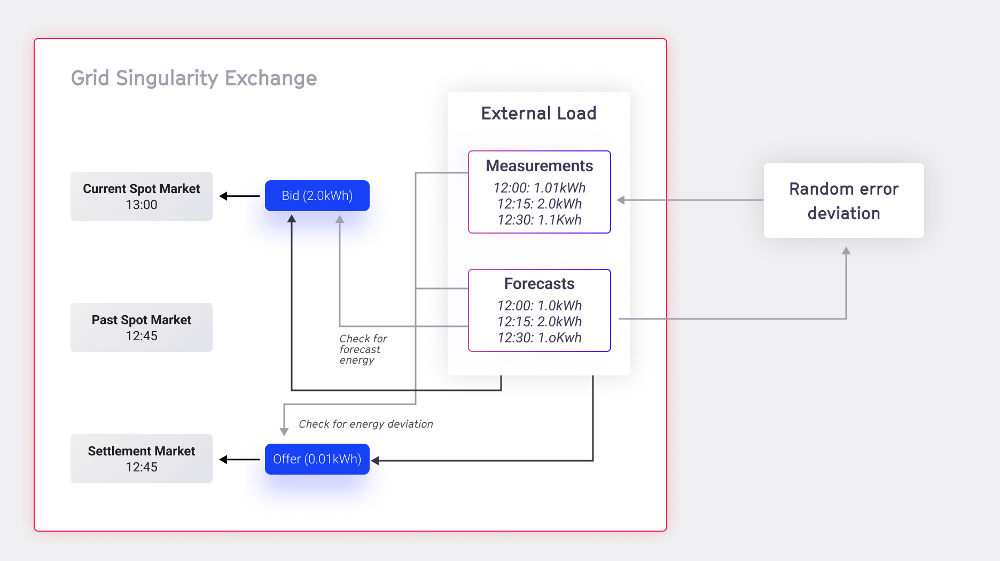

The main technical objective  of an electricity market exchange is to balance the grid in terms of demand and supply. Since efficient storage of large quantities of energy is currently not economically feasible and electrical current varies within seconds, a market mechanism that efficiently accounts for the physical energy production and consumption is required. Generally, trading occurs in the following  types of markets with different time intervals:


1. **[Spot market](market-types.md#spot-market)**: short-term trades for immediate or near-term delivery. Energy transactions are divided into small time blocks (typically 15-minute slots) that can either be traded on the Day-ahead or in the Intraday market.
2. **[Balancing market](market-types.md#balancing-market)**: trades for balancing capacity, procured by the balancing responsible parties (BRP). The traded energy capacity can be activated in order to mitigate any grid imbalances and to ensure the physical balance between generation and production.
3. **[Settlement market](market-types.md#settlement-market)**: post-delivery trades of deviations between energy physically produced/consumed and energy purchased in the spot or futures market to settle imbalances locally before BRP billing.
4. **Flexibility market**: short-term markets, where flexibility is bought shortly before it is needed on the network (day-ahead, or even intraday).
5. **Futures market**: Trades for the longer term future consumption and production of energy are agreed in advance. This market is currently in development of Grid Singularity energy exchange implementation.
6. Community trading / peer-to-market type: assumes a collective self-consumption scheme, where the energy generation in the community is aggregated and then allocated in a predetermined allocation coefficient to each member. In this case, the trading only occurs between one community member and one renewable asset, usually member-owned or community-owned and shared solar panel (PV) rather than among all assets in the community.

The current implementation of Grid Singularity Exchange focuses on peer-to-peer spot and balancing markets, with a commercial peer-to-market community trading application available via [Grid Singularity’s Social Community Manager](https://gridsingularity.com/scm){target=_blank}. Balancing markets take place immediately after each spot market slot (if enabled). The duration of the markets can be configured.


<figure markdown>
  {:text-align:center"}
  <figcaption><b>Figure 3.5</b>: Market Types implemented in Grid Singularity Exchange.
</figcaption>
</figure>


#### Simulated Time
Simulated time is the time unit within a simulation as opposed to real-time which is the real-life time that the simulation takes (7 days of trading can be simulated in minutes or hours).


#### Market Slots

The energy spot market is divided into time slots, with the default in the Grid Singularity  simulation interface (Singularity Map) set to 15 minutes of simulated time. For a one-day simulation, 96 market slots would occur with the default setting. Learn how to adjust market slot length [here](community-settings.md).

Depending on the market type, bids and offers are either matched within or at the end of each slot. Bids and offers that remain unmatched at the end of a market slot are annulled, and assets may be penalised for any energy they physically produce or consume that is not transacted.


#### Market Ticks

Each market slot is further segmented into ticks. The default setting for a tick is 15 seconds of simulated time, and this configuration may be changed. The default 15-minute market slot is made up of 60 15-second ticks.

In a pay-as-bid market, for instance, the market is cleared at the end of each tick. If an order is not matched, it is [propagated to the hierarchically higher and lower markets](trading-agents-and-strategies.md#trading-agents-and-bidsoffers-process-in-hierarchical-market-structure) by a Market Agent after two ticks). If an order is not matched at the end of two next ticks, it is further propagated to connected markets in the subsequent ticks following the same logic.


## Spot Market
In a local energy market (LEM), bids and offers are matched according to the selected market mechanism. A market mechanism is a category of algorithms that ensures that energy bids are associated with energy offers in a way that the energy price of both the bids and the offers is successfully met. In addition to that, a market mechanism is responsible for calculating the clearing price, which is the price that the consumer of energy pays to the producer of energy for each bid-offer match. Studies show that different market mechanisms offer diverse  benefits and limitations relating to market efficiency, fairness, and user choices. In the Grid Singularity Exchange (previously termed D3A), three spot market mechanisms are implemented:


1. [One-Sided Pay-as-Offer Market](market-types.md#one-sided-pay-as-offer-market)
2. [Two-Sided Pay-as-Bid Market](market-types.md#two-sided-pay-as-bid-market)
3. [Two-Sided Pay-as-Clear Market](market-types.md#two-sided-pay-as-clear-market)

### One-Sided Pay-as-Offer Market
In the One-Sided Pay-as-Offer market, trading agents representing energy producers, including prosumers (hereinafter termed “sellers) post offers in the market with an energy price determined by the [assets' trading strategies](trading-agents-and-strategies.md).

Agents representing consumers (hereinafter termed “buyers”) can see the offers available in their local market, filter affordable offers and then select the most favourable offer. The energy rate upon which the seller and buyer settle is the price of the offer (pay-as-offer). Consequently, the trade rate may differ for trades settled in the same slot. The auction is continuous, meaning that once an offer is posted, it can be accepted immediately, even before the end of each market slot.

### Two-Sided Pay-as-Bid Market
In the Two-Sided Pay-as-Bid market, buyers are able to place bids in the market, alongside the offers placed by sellers.

Each market collects and matches bids and offers issued by trading agents, and dispatches bids and offers to other markets via a Market Agent, which is created automatically in the Grid Singularity Exchange for  each market in order to  forward bids and offers to the connected markets.

The auction in the Two-Sided Pay-as-Bid is continuous, meaning that once an offer or bid is posted, it can be matched immediately, even before the end of the market slot. Bids and offers can also be annulled by the Market Agent, in case the asset that created the offer or bid that was forwarded decides to delete it ifit no longer intends to procure or sell its energy. In such a case, the asset notifies the relevant Market Agent that the offer or bid is no longer available, and removes the forwarded offer or bid from the market. Similarly, the price of the forwarded offers and bids can be updated by the Market Agent.

The market constantly triggers the matching between bids and offers according to the matching algorithm as illustrated in the figure below.


<figure markdown>
  {:text-align:center"}
  <figcaption><b>Figure 3.6</b>: Two-Sided Pay-as-Bid Market mechanism in the Grid Singularity  Exchange.
</figcaption>
</figure>


### Two-Sided Pay-as-Clear Market

In the Two-Sided Pay-as-Clear market, buyers are able to place bids in the market alongside the offers placed by sellers.

The market collects and matches bids and offers issued by trading agents, and dispatches bids and offers to other markets via the Market Agent. Bids and offers can also be annulled by the trading agent. Market Agents are created automatically in the  Grid Singularity Exchange for each  market,  in order to [forward bids and offers to the connected markets](trading-agents-and-strategies.md).

Currently, there is a merit-order-effect mechanism implemented for bid and offer matching where bids and offers are aggregated and cleared in a specified clearing interval. At the end of each interval, bids are arranged in a descending order, offers in an ascending order and the equilibrium quantity of energy and price is calculated. The clearing point (the quantity of energy that is accepted trade volume for a specific energy rate clearing price) is determined by the point where the arranged bid curve for the buyers drops below the offer curve for the sellers.


<figure markdown>
  {:text-align:center"}
  <figcaption><b>Figure 3.7</b>: Two-Sided Pay-as-Clear Market mechanism in the Grid Singularity Exchange.
</figcaption>
</figure>


The highest bids are matched with the lowest offers. The matching rate is the clearing price (cents/kWh). The remaining bids and offers (right of the clearing point in the plot above) are not cleared at this clearing point and remain in the market for later matching.


## Balancing Market

The Grid Singularity Exchange bottom-up market design allows participants to engage in local energy markets (LEM) for energy trading, providing energy balance at a local level. Grid Singularity’s implementation of a balancing market also facilitates the procurement of flexibility locally from LEM participants to assist the distribution grid operators (DSOs) in balancing the grid. At the moment, this implementation is available only by using the Grid Singularity Exchange backend code. The following sections describe the balancing market structure and explain our approach.

### Balancing Market Structure
Electrical power systems are characterised by voltage and frequency and the flow of electricity is a continuous process. Buffering or storing electrical energy at each node is still not feasible, and therefore electrical energy needs to be generated exactly at the time of consumption. Differences in supply and demand causes the nominal frequency (50Hz in EU) to deviate. Consequently, supply and demand need to be monitored in real time to implement adjustments to maintain equilibrium and nominal frequency, avoiding [cascading effect culminating in a blackout](https://fsr.eui.eu/publications/?handle=1814/67610){target=_blank}. Transmission system operators (TSOs) ensure the continuation of operation of the transmission grid during significant transient faults. They oversee fast, flexible, fossil fuel-based and / or renewable generation units, energy storage systems (e.g. battery power plants) and manage the demand response service, implementing frequency control strategies to balance electrical systems.


Each control strategy has specific purposes and features and can be categorised in three groups, as shown in the figure below.

1. **Primary Control** (Frequency Containment Reserve - FCR)
2. **Secondary Control** (Automatic Frequency Restoration Reserves - aFRR)
3. **Tertiary Control** (Manual Frequency Restoration Reserves - mFRR)


<figure markdown>
  {:text-align:center"}
  <figcaption><b>Figure 3.8</b>: The three tiers of grid control and its activation structure (source: Karel de Brabandere, <a href="https://www.semanticscholar.org/paper/Voltage-and-Frequency-Droop-Control-in-Low-Voltage-Brabandere/b0e2b215c34f3a88318376d29188c34eb913d5b5">Voltage and Frequency Droop Control in Low Voltage Grids by Distributed Generators with Inverter Front-End</a>, Engineering, 2006)
</figcaption>
</figure>


In conventional grid structures:

**Primary control** is an automatic function that is almost instantaneously activated to stabilise the frequency drops/spikes. It is the fastest type of frequency control with a response time of a few seconds and operates using a joint process involving all TSOs of the synchronous area. This is shown in the figure below. For example, if there is an increase in demand, the energy used to compensate for this demand comes from the kinetic energy stored in large rotating synchronous generators that start decreasing its velocity. This is referred to as [inertial response](https://eepower.com/technical-articles/frequency-control-in-a-power-system/#){target=_blank}. For the generators to recover the speed, the speed controller of each generator acts to increase the generator power to clear the imbalance. Within a period of 30 seconds, each generating unit is able to generate the required power and stabilise this production for at least 15 minutes or depending on the requirements of the TSO within the synchronous region. Primary control is done using generation plants that are connected to the high voltage power supply with the exception of renewable energy sources which are non-schedulable due to its intermittent nature.


<figure markdown>
  {:text-align:center"}
  <figcaption><b>Figure 4.5</b>: Recovery of the system from a contingency event and action by primary frequency control (source: Paul Denholm, Trieu Mai, Rick Wallace Kenyon, Ben Kroposki, and Mark O’Malley, National Renewable Energy Laboratory, <a href="https://www.nrel.gov/news/program/2020/inertia-and-the-power-grid-a-guide-without-the-spin.html">Inertia and the Power Grid: A Guide Without the Spin</a>, May 2020)
</figcaption>
</figure>


**Secondary control** is performed automatically by all the generators to restore the nominal frequency, the power exchanges and reserve of the generators used in primary control. The generators involved in this regulation function through dedicated reserve power that are set in conjunction with central controllers. The reserve control power is negotiated in a contract conjunction with the TSO and is a percentage of the maximum available power with a predefined minimum value to ensure that it can be dispatched whenever needed. This service is remunerated according to the set contracts.

**Tertiary control** is not an automatic function and is executed upon request by the grid operator. The reserve margins used for the secondary control are restored through tertiary control.
The differences between the primary, secondary and tertiary frequency control is the time the production and response can be activated, and the remuneration for each. Primary frequency control is symmetrical as the capacity for control has been scheduled and usually balances between ramping up and down the production and therefore not remunerated. Secondary and tertiary control are not symmetrical as the capacity can be used only for ramping up or down the production to restore the frequency and are remunerated.


#### Review of the three levels of regulation

<table class="table">
  <tr>
   <th>
   </th>
   <th>Response Time
   </th>
   <th>Duration Time
   </th>
   <th>Operation
   </th>
   <th>Purpose
   </th>
  </tr>
  <tr>
   <td>Primary Control
   </td>
   <td>10-30 Seconds
   </td>
   <td>15 Minutes
   </td>
   <td>Automatic
   </td>
   <td>Act in case of frequency variation in order to stabilise frequency value
   </td>
  </tr>
  <tr>
   <td>Secondary Control
   </td>
   <td>200 Seconds
   </td>
   <td>120 minutes
   </td>
   <td>Automatic
   </td>
   <td>Act to bring back frequency value to the nominal value and restore the power reserve of the generators used for the primary frequency control
   </td>
  </tr>
  <tr>
   <td>Tertiary Control
   </td>
   <td>15 Minutes
   </td>
   <td>Indicated by TSO
   </td>
   <td>Upon Request
   </td>
   <td>Act to restore power reserves of the generators used for the secondary frequency control
   </td>
  </tr>
</table>

***Table 3.1***: *[Main features of frequency control strategies](https://eepower.com/technical-articles/frequency-control-in-a-power-system/#){target=_blank}*


In our **transactive energy low voltage grid structure** primary, secondary and tertiary control are controlled by a variation of the Market Agent, termed the Balancing Agent for this market type.
The Balancing Agent is responsible for monitoring power imbalances in the segment of the electricity grid that it controls, and it compensates for these imbalances with the balancing energy purchased by the community assets in the balancing market. It therefore also manages communication to the balancing market and it manages trading in the balancing markets for different segments of the electricity grid.

**Primary control** happens simultaneously as the spot market through a droop curve. Grid forming assets have different droop curves based on their behaviour (Consumption Profiles/Loads, Storage/Battery, Solar Panel/PV) which are used to keep the voltage and frequency towards nominal in case of a deviation. Local balancing is therefore done through primary control.

**Secondary control (Inertia Control)** is done through a time schedule. The schedule is received from the upper tertiary control or from a ledger. Secondary Balancing Agents adjust the primary Balancing Agents resources within its market by disconnecting and connecting them in case of failure of upstream structure or failure to meet the schedule.

**Tertiary control** negotiates the schedules upstream or downstream at lowest cost of operation and provides a marketplace for energy in and out of the market area. The inputs of the tertiary control are the bids, offers and error signals from secondary control. The outputs are the schedules to resources.


### Balancing Market Implementation in the Grid Singularity Exchange


<figure markdown>
  {:text-align:center"}
  <figcaption><b>Figure 3.10</b>: Structure of Balancing Market in Grid Singularity Exchange.
</figcaption>
</figure>


#### Balancing Assets
In the Grid Singularity Exchange, balancing has been implemented using:

*  Fast responding non-critical loads to provide load shedding
*  Battery storage
*  Commercial power plants

The trading strategies of [energy assets](configuration.md) can be used to balance the grid by placing balancing offers. These assets participate in the balancing market only if they are registered in the Balancing Asset Registry.

#### Balancing Asset Registry
The Balancing Asset Registry is a dictionary that contains the names of assets as keys and the balancing rates as tuple values: (demand balancing rate, supply balancing rate).
```python
asset_registry_dict = {
    "H1 General Load": (33, 35),
    "H2 General Load": (33, 35),
    "H1 Storage1": (33, 35),
    "H1 Storage2": (33, 35),
}
```

#### Balancing Market Type

The present balancing market type setting is a [One-Sided Pay-as-Offer market](market-types.md#one-sided-pay-as-offer-market), which accepts _balancing_offers_ from energy assets and connected hierarchies of _balancing_market_. _balancing_offers_ could be positive or negative. It also facilitates the _balancing_trade_.

#### Balancing Agent
The Balancing Agent follows the lead of the _spot_market_trade_ of its lower hierarchy. Whenever there is a trade in the lower hierarchy of _spot_market_, it will try to secure a share of spot market trades in the balancing market.

#### Balancing Market Constant Parameters
The following are the constant parameters related to the balancing market, with defaults available [here](https://github.com/gridsingularity/gsy-framework/blob/master/gsy_framework/constants_limits.py){target=_blank}.

ENABLE_BALANCING_MARKET →  (Default: False) (It enables the simulation with Balancing Market)

BALANCING_SPOT_TRADE_RATIO →  (Default: 0.2) (It dictates the ratio of spot_market_energy to be traded in balancing market)

BALANCING_OFFER_DEMAND_RATIO → (Default: 0.1) (It dictates the ratio of spot_market_energy to be offered in balancing market as demand_balancing_offer)

BALANCING_OFFER_SUPPLY_RATIO → (Default: 0.1) (It dictates the ratio of spot_market_energy to be offered in balancing market as supply_balancing_offer)

BALANCING_FLEXIBLE_LOADS_SUPPORT → (Default: True) (It enables [Load Trading Strategy](consumption.md) to place supply_balancing_offer (effectively curtailing it's load))

Examples of balancing market setups are available [here](https://github.com/gridsingularity/gsy-e/tree/master/src/gsy_e/setup/balancing_market){target=_blank}.


## Settlement Market

### Settlement Market Structure
Spot and futures trading requires predictions of energy use at both the asset and network level, which are often associated with high prediction errors. Thus, although a balancing mechanism should deal with the energy imbalances on the physical level, financial exchanges might still not be settled, causing a mismatch between physical energy delivery and market accounting. Some market approaches create orders and matches based on the last 15-minute slot’s energy use (post-delivery, read by smart metres) to solve this problem. Others allow the grid operator to set prices or enforce penalties for any deviance Symbiotic Energy Markets concept espoused by [Grid Singularity’s technical approach](technical-approach.md) allows similar post-delivery trading by all market participants.

Deviations between energy physically produced/consumed and energy purchased in the spot or futures market can be traded post-delivery by submitting a time slot in the past as a requirement attached to a bid or offer, creating a settlement market (figure 3.8). Bids and offers will be matched leveraging the [two-sided pay-as-bid matching mechanism](market-types.md#two-sided-pay-as-bid-market). This allows local deviations to balance without penalty (e.g. a local solar panel that overproduces matches their deviation to a local load that over-consumed), with the remainder filled at a market rate (likely a premium) by individual assets, balancing groups, or grid operators that provided balancing services during delivery. A specific limit may be introduced to represent the time interval in which post-delivery trading can be conducted.


<figure markdown>
  {:text-align:center"}
  <figcaption><b>Figure 3.11</b>: Energy deviations (difference between purchased and delivered energy) can be traded in the settlement market instead of paying a penalty to the grid operator, reducing inefficient accounting. Any remaining deviance can still be penalised by the grid operator.
</figcaption>
</figure>


### Settlement Market Implementation in the Grid Singularity Exchange backend

#### Settlement market settings

If [`ConstSettings.SettlementMarketSettings.ENABLE_SETTLEMENT_MARKETS`](https://github.com/gridsingularity/gsy-framework/blob/175a9c3c3295b78e3b5d7610e221b6f2ea72f6ec/gsy_framework/constants_limits.py#L70){target=_blank} is set to True, settlement markets are created for each market cycle. For each past spot market, there is always a respective settlement market. The settlement market order book is kept open for placing bids and offers for a number of hours after energy delivery, which the user sets with [`Const.Settings.SettlementMarketSettings.MAX_AGE_SETTLEMENT_MARKET_HOURS`](https://github.com/gridsingularity/gsy-framework/blob/175a9c3c3295b78e3b5d7610e221b6f2ea72f6ec/gsy_framework/constants_limits.py#L69){target=_blank}, contrary to the operation of the spot market, which keeps its order book open for 15 minutes (starting 15 minutes before the energy delivery).

Spot and settlement markets are functionally connected.By accessing trades of the corresponding spot market for the energy delivery period, the settlement market reads the traded energy by each asset and compares it with energy measurements of each asset, calculating any energy deviation of the expected consumed or produced energy.


<figure markdown>
  {:text-align:center"}
  <figcaption><b>Figure 3.12</b>: Example of settlement markets available for each market slot and their time rotation in the Grid Singularity Exchange.
</figcaption>
</figure>


#### Assets’ trading strategies in settlement markets

Prosumer assets can post orders (bids/offers) of their energy deviations to the settlement market in order to get compensated by another entity that deviated inversely. Energy deviations are calculated as the difference between the forecasted and measured production or consumption.

#### External asset strategies in settlement markets

Asset owners or asset aggregators (other entities managing energy assets on behalf of the asset owners) can post the forecasted and measured energy to the Grid Singularity Exchange for each market slot via the [Asset API](configure-trading-strategies-walkthrough.md) with the batch commands _set_energy_forecast_ and _set_energy_measurement_.

Posting and updating bids and offers in settlement markets functions in  the same way as in the spot markets. The asset can provide its desired energy delivery period for which it wants to contribute to the settlement operation, by using the _time_slot_ attribute of the bid and the offer. The asset can also define the settlement energy that it is willing to procure or sell, which is at most the amount of energy deviation of the asset for the energy delivery period.


<figure markdown>
  {:text-align:center"}
  <figcaption><b>Figure 3.13</b>: Settlement market posting energy deviations mechanism with external asset strategies.
</figcaption>
</figure>


#### Asset strategies in settlement markets
The Grid Singularity Exchange includes integrated trading strategies for the settlement market for all supported assets, enabling their automated participation to the settlement market without any intervention from the asset owner.  The settlement trading strategies are extensions of the [asset trading strategies](trading-agents-and-strategies.md#asset-trading-strategies-), with the additional abilities to measure the energy deviation of the asset prosumption and to use this deviation for posting bids and offers to the settlement markets.
Since they are extensions of the asset trading strategies, the settlement trading strategies participate in the spot market in exactly the same way as the asset trading strategies. Depending on the forecasted energy for the asset (as described in detail [here](configuration.md)), they post bids and offers to the spot market first. After some energy is traded on the spot market, the settlement trading strategies wait for the energy delivery and then verify that the traded energy from the asset corresponds to the produced or consumed energy of the asset. If there is an energy deviation between the traded energy and the measured energy, the settlement trading strategies use this deviation for posting a bid or offer with energy value equal to the energy deviation of the asset. For example, if a PV forecasted to produce 5kWh of energy for the 12:00 market, but the simulated measured energy reveals that the it only produced 4kWh for that time slot, the template strategy will post a bid to the 12:00 settlement market with the energy 1kWh. The behaviour for the price increase of this bid is the same as in the spot market: the energy rate of the bid is increased during the market until the Final selling rate is reached.

As the settlement market will stay available for longer than the normal spot market (configurable by [`Const.Settings.SettlementMarketSettings.MAX_AGE_SETTLEMENT_MARKET_HOURS`](https://github.com/gridsingularity/gsy-framework/blob/175a9c3c3295b78e3b5d7610e221b6f2ea72f6ec/gsy_framework/constants_limits.py#L69){target=_blank}, please also see [here](market-types.md#settlement-market-implementation-in-the-grid-singularity-exchange-backend-)), the template strategy will not update the orders as frequently as in the normal spot market, but following the time interval set by the parameter  [`SettlementTemplateStrategiesConstants.UPDATE_INTERVAL_MIN`](https://github.com/gridsingularity/gsy-e/blob/7f5d2866cfd8b8327e590a1377db2d9bd2909746/src/gsy_e/constants.py#L72).


<figure markdown>
  {:text-align:center"}
  <figcaption><b>Figure 3.14</b>: Settlement market posting energy deviations mechanism with template asset strategies.
</figcaption>
</figure>


## Community Trading Market

Currently, EU members like Spain support peer-to-market energy trading, meaning that the regulator determines a single trading price for the community. The community manager in this type of jurisdiction can choose to enable community trading or to exclusively allow energy sharing of local generation. The latter is also known as a collective self-consumption scheme, where the energy generation in the community is aggregated and then allocated in a predetermined allocation coefficient to each member. These coefficients are set by the energy community manager and are usually based on the share of generation that is owned or leased by the individual community member. The price of external energy supply to match any demand that is not satisfied locally is determined by the supplier (utility rate) and the price of local generation sold to the grid by the applicable feed-in-tariffs. Other charges include grid fees and taxes to account for network costs and in some EU countries these are subsidised. Finally, there are fees applied by the energy community manager that also include the cost of the SCM tool provided by Grid Singularity and may include additional charges for supplying data measurement devices or any support services. To this the cost of leasing any renewable energy like solar is added for those who use that service. All of these components are illustrated in the energy community member application interface.
