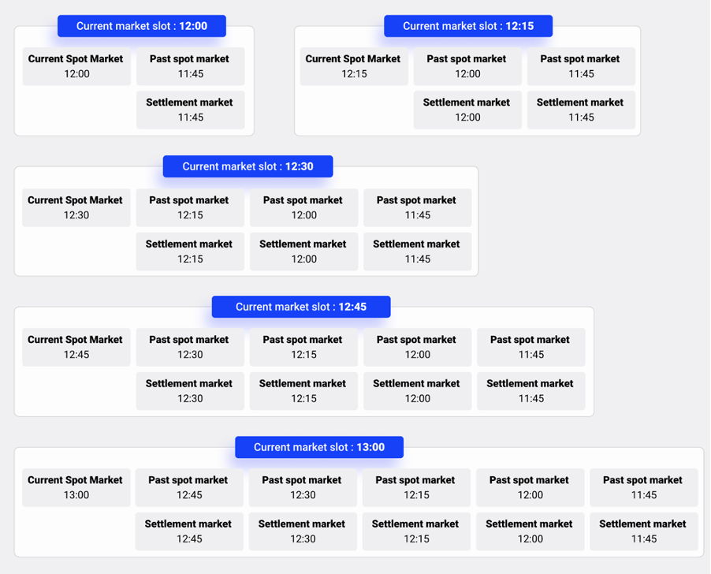

If [`ConstSettings.SettlementMarketSettings.ENABLE_SETTLEMENT_MARKETS`](https://github.com/gridsingularity/gsy-framework/blob/175a9c3c3295b78e3b5d7610e221b6f2ea72f6ec/gsy_framework/constants_limits.py#L70){target=_blank} is set to True, settlement markets are created on each market cycle. For each past spot market, there is always a respective settlement market. The settlement markets are kept open for placing bids and offers for the amount of hours the user sets with [`Const.Settings.SettlementMarketSettings.MAX_AGE_SETTLEMENT_MARKET_HOURS`](https://github.com/gridsingularity/gsy-framework/blob/175a9c3c3295b78e3b5d7610e221b6f2ea72f6ec/gsy_framework/constants_limits.py#L69){target=_blank}.

In contrast to a normal simulation run, the past slot markets are also kept in memory for the same amount of time in order to generate live results including past markets and the settlement markets. Only one past settlement market is kept in memory. This is also only for keeping track of the statistics, no offers and bids can be placed there.

<figure markdown>
  {:text-align:center"}
  <figcaption><b>Figure 4.9</b>: Example of settlement markets available for each market slot and their rotation.
</figcaption>
</figure>
