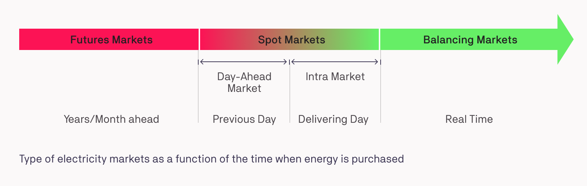

## Status Quo

To give a better overview of the interaction of the D3A with the existing electrical grid, we first discuss a typical market structure:

The main goal of an electricity market is always to balance the grid in terms of demand and supply. Since massive storage of energy is currently not economically feasible and electrical current varies within seconds, a market structure that efficiently allocates production and consumption is necessary. Generally, trading occurs in three different kind of markets that each have different time intervals:

1. Futures market: futures (long term trades) between consumption and production are agreed upon. This market is currently left outside the scope of D3A implementation.
2. Spot market: typically 15 minutes, agents within the grid are trading through a one-sided pay-as-offer, double-sided pay-as-bid or double-sided pay-as-clear auction.
3. Grid balancing market: imbalances that occur between agreements in the spot market due to changes in consumption and production are absorbed by balance responsible parties that are reimbursed for their service.



 

## D3A

The current implementation of the D3A focuses on the spot & balancing market. In contrast to the status quo, balancing markets take place in parallel to the spot markets (if enabled).
The duration of the markets can be configured. 
Currently, three spot market types are implemented:

1. Single sided pay-as-offer
2. Two sided pay-as-bid
3. Two sided pay-as-clear

In the d3a setup file, the spot market type can be defined by the following line (example for one sided pay-as-offer):

```
ConstSettings.IAASettings.MARKET_TYPE = 1
```

Setting the market type influences the behaviour of both the markets as well as the behaviour of the devices or agents. For individual behaviour of the device strategies please refer to [Strategies](load-strategy.md) documentation.