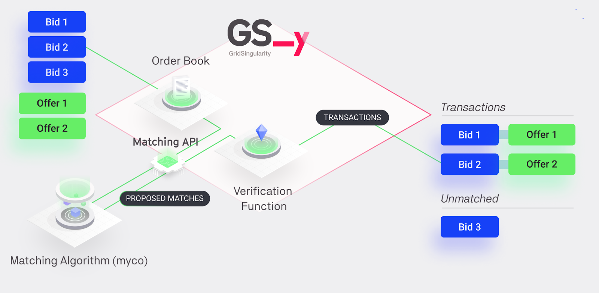

The Grid Singularity Matching Application Programming Interface (or Matching API) allows custom matching algorithms to be used to clear orders in local or other energy markets. The Matching API decouples the matching process from the exchange, allowing algorithm providers (also termed matching engines here) to read the exchange’s order book, run custom matching algorithms and send the resulting energy transactions to be verified and executed by the exchange, as shown in Figure and explained below.

**Figure**. *Flow diagram of the role of matching engines (third party matching algorithm providers) in the Grid Singularity Exchange.*

Trading process through the Matching API:

1. **Bids and Offers creation** - [Bids and Offers](trading-agents-and-strategies.md) are created on behalf of the [energy assets](configuration.md) (either by using the [default GSy trading strategy](trading-agents-and-strategies) or through the [Asset API](configure-trading-strategies-walkthrough.md)) and sent to the exchange.

2. **Order book** - The exchange gathers the bids and offers for all the different markets, which are currently organised in a [hierarchical structure](trading-agents-and-strategies.md).

3. **Request Bids and Offers** - The Matching API requests bids and offers for [specific markets](matching-api-commands.md), and receives a dictionary containing all bids and offers posted in the chosen markets.

4. **Matching** - The Matching API pairs bids and offers together according to an external matching algorithm provided by a third-party matching algorithm provider and sends the proposed bid/offer pairs (technically called *recommendations*)  back to the exchange.

5. **Verification function** - Each recommendation is submitted to  the exchange’s verification function, a mechanism that checks whether the [clearing rate](market-types.md#two-sided-pay-as-clear-market) and the energy to be traded proposed by the recommendation respect the bids and offers’ [attributes and requirements](trading-agents-and-strategies.md#bidoffer-attributes-and-requirements-for-trading-preferences-degrees-of-freedom).

6. **Transactions and rejections** - Recommended matches that pass the verification function’s check will be submitted as transactions in the Grid Singularity exchange. Recommendations rejected by the verification function will trigger a notification through the Matching API and not be sent to the exchange for clearing.

It is important to note that the Matching API is **asynchronous** towards the exchange, meaning  that [it can request bids and offers](matching-api-commands.md) and send recommendations at any time during the [market slots]('market-types.md').

_The GSy Matching API code is currently available in Python, as well as in Rust for the [GSY DEX Matching API](blockchain-matching-engine.md#gsy-dex-matching-api) Implementation._
