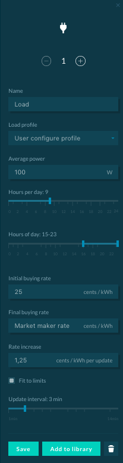

The load is an energy asset that consumes energy over time. It is possible to use a single load to represent an entire consuming building, as well as to configure multiple loads to represent different assets within a building (e.g. washing machine, air-conditioner, etc.).

##User Interface Configuration

The following parameters can be configured:

*   **Load name**: Must be unique
*   **Load profile**: The user can choose between two options:
    *   User upload profile (a load profile can be uploaded when compliant with Upload File Formats)
    *   User configure profile (the user provides the load average power)
*   **Average power**: average consuming power of the load in Watts.
*   **Hours per day**: The number of hours the load operates per day.
*   **Hours of day**: The time range in which the load operates.
*   **Initial buying rate**: Initial energy buying rate at the beginning of each market slot in cents/kWh.
*   **Final buying rate**: Final energy buying rate at the end of each market slot in cents/kWh. It can either be a user-defined value or equal to the Market Maker + Grid Fee.
*   **Rate increase**: Explicit rate increase increment per update interval in cents/kWh
*   **Fit to limits**: Derive bidding behavior from a linear fitted curve of a buying rate between `initial_buying_rate` and `final_buying_rate` within the bidding interval. If activated, `energy rate_increase = (final_buying_rate - initial_buying_rate) / max(int((slot_length / update_interval) -1), 1)`
*   **Update interval**: The frequency at which the rate is updated.

The Load configuration interface is shown below:

{:style="height:800px;width:220px"}

##Backend Configuration

To implement the load in a backend simulation, two options are available :

[User configure Profile](https://github.com/gridsingularity/gsy-e/blob/master/src/gsy_e/models/strategy/load_hours.py){target=_blank}

```python
Market('Load', strategy=LoadHoursStrategy(avg_power_W=200, hrs_per_day=6,hrs_of_day=list(range(12, 18)), initial_buying_rate=0, final_buying_rate=35))
```

[User upload Profile](https://github.com/gridsingularity/gsy-e/blob/master/src/gsy_e/models/strategy/predefined_load.py){target=_blank}

```python
user_profile_path = os.path.join(gsye_root_path,"assets/load.csv")
Market('Load', strategy=LoadProfileStrategy(daily_load_profile=user_profile_path, initial_buying_rate=0, final_buying_rate=35))
```

##Addendum: hrs_of_day and hrs_per_day

hrs_of_day defines the allowed time-window in which the load has to consume for a time defined by hrs_per_day.

For example, a user can input 5 hrs_per_day and give a wider range for hrs_of_day like (2,18). The Load will try to consume as fast as possible during this time if there is any offered energy to purchase within the limits of `initial_buying_rate` and `final_buying_rate` set parameters.

*   If there is sufficient energy at affordable rates, the load will consume in the first 5 hours, i.e. from 02:00 until 07:00, with no energy demand unmatched.
*   In case energy prices are too high during the time-interval from 04:00 to 16:00, the load will consume from 02:00 until 04:00, turn off, and consume from 16:00 until 18:00, resulting in one hour of energy demand unmatched.

For information on changes in buying and selling rates, please see: [Trading strategies](trading-agents-and-strategies)
