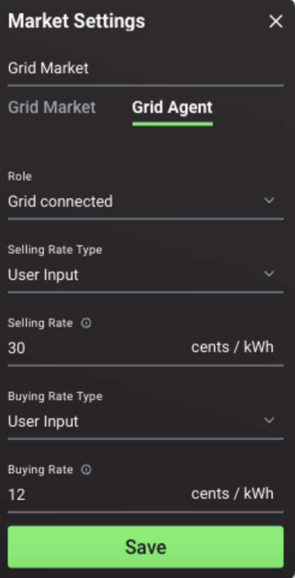

#  Market Maker (utility pricing) Configuration

The Market Maker mimics the behaviour of a typical energy utility and is used as a price reference point. Only one Market Maker can be set per simulation. The Market Maker can be configured to sell an infinite amount of energy as well as to buy an infinite amount of energy to simulate a Feed-in Tariff.

##User Interface Configuration

The following parameters can be set:

*   **Name**: The name of the Market Maker.
*   **Role**: The user has two options:
    *   **Grid connected**: In this mode, the Market Maker is connected to the grid and thus can fulfil the energy demand of any consumer and absorb surplus generation
    *   **Islanded**: In this mode, the Market Maker would only be used as a reference point for the highest possible `energy_rate` in that grid (this mode is currently available only in the backend).
*   **Selling rate type**: The user can either select `User Input` to define a fixed selling rate or upload their custom selling rate profile (the latter is currently only available in the backend)
*   **Selling rate**: The fixed rate the Market Maker will enforce, if `User Input` is selected for the selling rate type.
*   **Buying rate type (infinite bus only)**: The user can either select `User Input` to define a fixed buying rate or upload their custom buying rate profile (the latter is currently only available in the backend).
*   **Buying rate (infinite bus only)**: The fixed rate the Market Maker will enforce, if `User Input` is selected for the buying rate type.

The Market Maker configuration interface is shown below:

{:style="height:400px;width:200"}

For more information on the backend configuration, please see the [backend documentation](assets-installation.md#market-maker).
