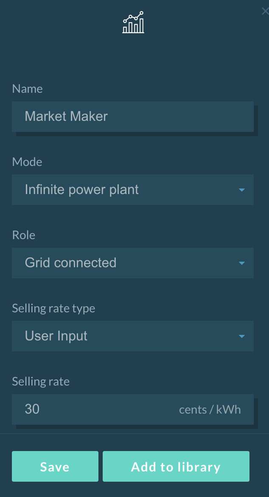

The Market Maker mimics the behaviour of a typical energy utility and is used as a price reference point. Only one Market Maker can be set per simulation. The Market Maker can be configured to sell an infinite amount of energy as well as to buy an infinite amount of energy to simulate a Feed-in Tariff.

##User Interface Configuration

The following parameters can be set:

*   **Name**: The name of the Market Maker.
*   **Mode**: The user has two options:
    *   Infinite power plant: In this mode, it has the ability to meet the infinite energy demand of consumers at the highest rate possible in that grid.
    *   Infinite bus: In this mode, the Market Maker has not only the ability to meet the infinite energy demand of the consumer but can also absorb the infinite generation surplus of prosumers/producers at the lowest rate possible in that grid.
*   **Role**: The user has two options:
*   **Grid connected**: In this mode, the Market Maker is connected to the grid and thus can fulfil the energy demand of any consumer and absorb surplus generation (if infinite bus mode selected)
*   **Islanded**: In this mode, the Market Maker would only be used as a reference point for the highest possible `energy_rate` in that grid.
*   **Selling rate type**: The user can either select `User Input` to define a fixed selling rate or upload their custom selling rate profile.
*   **Selling rate**: The fixed rate the Market Maker will enforce, if User Input is chosen for the selling rate type.
*   **Buying rate type (infinite bus only)**: The user can either select User Input to define a fixed buying rate or upload their custom buying rate profile.
*   **Buying rate (infinite bus only)**: The fixed rate the Market Maker will enforce, if User Input is chosen for the buying rate type.

The Market Maker configuration interface is shown below:

{:style="height:500px;width:275px"}

##Backend Configuration

To implement a market maker in a backend simulation, two methods are available :

[infinite power plant](https://github.com/gridsingularity/gsy-e/blob/master/src/gsy_e/models/strategy/market_maker_strategy.py):

```python
Market ('Market Maker', strategy=MarketMakerStrategy(energy_rate=selling_rate,
grid_connected=True))
```

[infinite bus ](https://github.com/gridsingularity/gsy-e/blob/master/src/gsy_e/models/strategy/infinite_bus.py):

```python
Market ('Market Maker', strategy=InfiniteBusStrategy(energy_buy_rate=22, energy_sell_rate=22))
```
