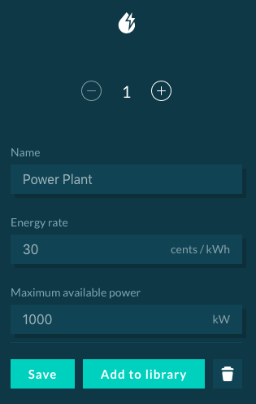

A finite power plant is an energy supplier that offers a configurable amount of power per time slot at a set rate.

##User Interface Configuration

The following parameters can be configured:

*   **Name**: Must be unique.
*   **Energy rate**: Selling price of the power plant in cents/kWh.
*   **Maximum available power**: Maximum power that the power plant can supply in kW (in the backend this parameter can also be set based on an uploaded profile).

The configuration interface is shown below:

{:style="height:450px;width:275px"}


##Backend Configuration

To implement the power plant in a backend simulation one option is available:

[Finite Power Plant](https://github.com/gridsingularity/d3a/blob/54d76a47db04062aa2564826b5da8e637d6c9185/src/d3a/models/strategy/finite_power_plant.py#L25){target=_blank}

```python
profile_kW = {
    0: 0.1,
    8: 0.15,
    12: 0.2,
    19: 0.15,
    22: 0.1
}
Market ("Power Plant', strategy=FinitePowerPlant(energy_rate=31.3, max_available_power_kW=profile_kW))
```
