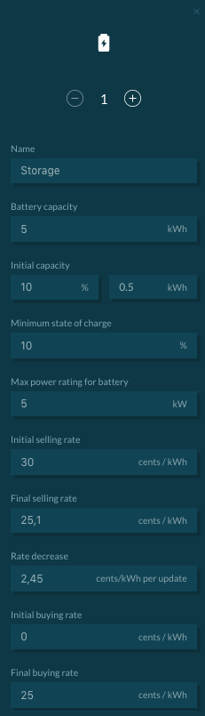

The storage simulates energy assets capable of storing or discharging energy (e.g. Lithium batteries, compressed air energy storage).

##User Interface Configuration

The following parameters can be configured:

*   **Name**: Must be unique
*   **Battery capacity**: Total energy capacity.
*   **Initial capacity**: Can be set in two ways:
    *   Initial State of Charge - SOC (in %)
    *   Initial Energy (in kWh)
*   **Minimum SOC**: Minimum energy to leave in the storage.
*   **Max power rating for battery**: Power limit for each market slot for sold and bought energy.
*   **Initial selling rate**: Initial energy rate for selling energy at the beginning of each market slot in cents/kWh.
*   **Final selling rate**: Final energy rate for selling energy at the end of each market slot in cents/kWh.
*   **Rate decrease**: Explicit rate decrease increment in cents/kWh.
*   **Initial buying rate**: Initial energy rate for buying energy at the beginning of each market slot in cents/kWh.
*   **Final buying rate**: Final energy rate for buying energy at the end of each market slot in cents/kWh.
*   **Rate increase**: Explicit rate increase increment in cents/kWh.
*   **Fit to limits**: Derive bidding behavior from a linear fitted curve of a buying rate between initial_buying_rate and final_buying_rate and a selling rate between initial_selling_rate and final_selling_rate within the bidding interval. If activated:
    *   energy_rate_increase = (final_buying_rate - initial_buying_rate) / max(int((slot_length / update_interval) -1), 1)
    *   energy_rate_decrease_per_update = (initial_selling_rate - final_selling_rate) / max(int((slot_length / update_interval) -1), 1)
*   **Update interval**: The frequency at which the rate is updated.
*   **Capacity based method**: The storage can trade energy based on a capacity dependent sell price (see addendum).

Note: For the time being, the storage component has a 100% electric-to-electric efficiency by default. Changing this characteristic is not possible at the moment but it will be possible in the near future. Users are welcome to add additional features to our open source code base on GitHub.

The storage configuration interface is shown below:

{:style="height:750px;width:250px"}
{:style="height:250px;width:250px"}


##Backend Configuration

To implement the storage in a backend simulation one option is available:

[Energy Storage System](https://github.com/gridsingularity/gsy-e/blob/master/src/gsy_e/models/strategy/storage.py){target=_blank}


```python
Market('Storage', strategy=StorageStrategy(initial_soc=50, energy_rate_decrease_per_update=3, battery_capacity_kWh=1.2, max_abs_battery_power_kW=5, final_buying_rate=16.99, final_selling_rate= 17.01)))
```


##Addendum: Storage Capacity Based Method

This method was created to sell energy at lower prices during high state of charge - SOC (when the battery has more energy stored) and at higher prices during low SOC (when the battery can afford to sell its stored energy for less).

If the `cap_price_strategy` is `True`, the offer price for the storage is calculated according to:

`offer_rate = initial_selling_rate - ((initial_selling_rate - final_selling_rate)\*soc/100)`

As an example, considering an `initial_selling_rate` of 30 cents/kWh and a `final_selling_rate` of 20 cents/kWh, a storage with an SOC of 1% would sell its energy at 29.9 cents/kWh, and a battery at 100% SOC would sell its energy at 20 cents/kWh.

##Storage Behaviour in Local Energy Markets

In general all bids and offers follow the physical constraint of the set `max_abs_battery_power_kW` value. The accumulated energy per market slot cannot exceed this power value times the length of the market slot. Energy sold and bought cancel each other out, meaning that if 2kWh are both sold and bought in the same market slot, the relative power remains 0kW.

For the buying rate increase and selling rate decrease behaviour, please see the [Trading Strategies page](trading-agents-and-strategies).

###Buying Energy in [One-Sided Market](market-types.md#one-sided-pay-as-offer-market):

On each tick, the storage scans the connected market for affordable offers* if there is storage space to be filled (if the current SOC is lower than 100%). Once an offer is found, it is either fully or partially accepted, depending on the demand. The storage always seeks 100% SOC when buying energy.

* = affordable offers are offers that have a price lower or equal to the current acceptable energy rate. The acceptable energy rate changes during a market slot depending on the `initial_buying_rate`, `final_buying_rate`, `energy_rate_decrease_per_update` and `update_interval` setting.

###Buying Energy in [Two-Sided Market](market-types.md#two-sided-pay-as-bid-market):

On each tick, the storage either places a bid for the quantity of energy it needs to reach 100% SOC or updates the price of an existing bid in the market where the bid rate depends on the `initial_buying_rate`, `final_buying_rate`, `energy_rate_decrease_per_update` and `update_interval` setting.

###Selling Energy

At the beginning of each market slot, the storage places an offer for all the energy it has stored (not including the energy that is needed to keep the storage at least at min_allowed_soc). This offer is updated at each `update_interval` pursuant to the rate decrease settings. This mechanism applies in both one and two-sided market types. Consequently, it is possible for the storage to have both an offer and a bid placed in the same market.
