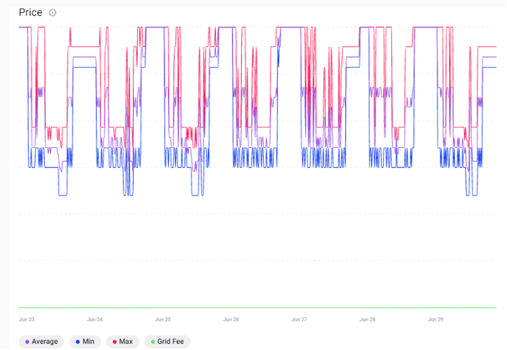

The price graph shows the minimum, the maximum and the average price of energy in €/kWh for each 15-minute market slot in a market. The grid fee is also shown if applied. If no trade occurred during a certain market interval, no lines are plotted. If grid fees are set in that market as a constant value, a fourth line is plotted to reflect its price.

<figure markdown>
  {:text-align:center"}
  <figcaption><b>Figure 30</b>: Graph showing the evolution of the prices during the simulation period in the Grid Singularity’s simulation interface (Singularity Map)
</figcaption>
</figure>
