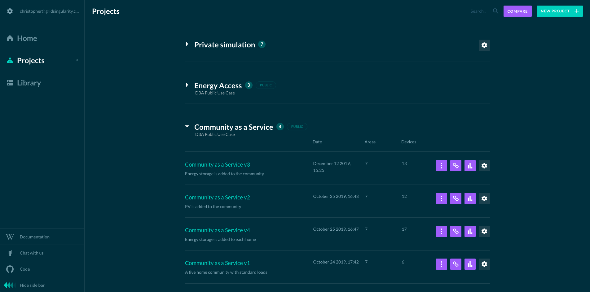

After logging in, the user lands on the home page. It shows an overview of all projects and configurations. Projects can be either private or public. Projects can be set up as separate use cases or grid locations in order to keep versions organized in one project folder. Within a project, the user can make several versions by creating duplicates of simulations and thus iteratively optimizing a particular grid configuration or use case. Public projects will appear on the user's home page. The simulations in these projects can be viewed by the user as examples and also duplicated to a new project made by the user. As a duplicated simulation in a user's own project, the user can edit the simulation.

#### Projects 

Projects can be used to group simulations. They can be seen as folders in which simulations are located.
Before creating a simulation, a project has to be created by selecting the New Project button: 

{:style="height:45px;width:160px"}

The following symbol notifies the user that a project is public :

{:style="height:40px;width:100px"} 

#### Simulations

To create a new simulation, select the *New Simulation* button shown below. The user will then be redirected to the [General Settings](general-settings.md).

{:style="height:45px;width:180px"}

**The following quick links are available for each simulation:**

 {:style="height:50px;width:50px"} Run the simulation and redirect the user to the [Results Page](results.md)
 
 {:style="height:50px;width:50px"} Redirects the user to the [Results Page](results.md)

 {:style="height:50px;width:50px"} Edit the [General Settings](general-settings.md) of the simulation

 {:style="height:50px;width:50px"} Edit the grid setup of the simulation

 {:style="height:50px;width:50px"} Duplicate the configuration, download the results or delete the simulation

#### Search

Projects and simulation can be filtered by name, using this search field found on the upper right:

{:style="height:75px;width:200px"}

#### Compare

The user can compare 2 simulations results side by side by clicking on the compare icon:

{:style="height:35px;width:100px"}
