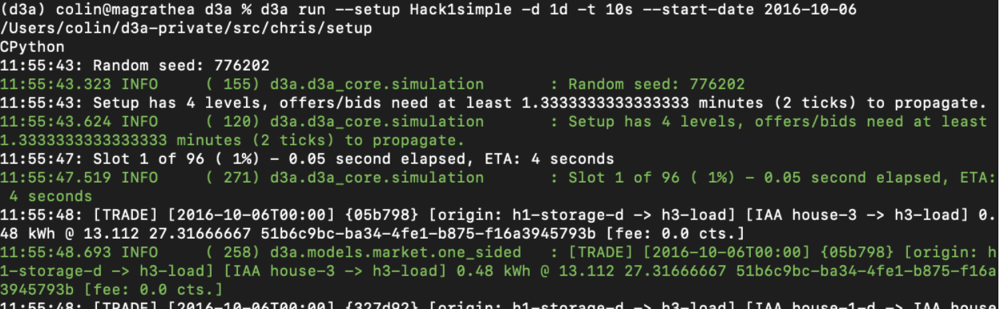

###Start Redis server

To use the API locally, your script interacts with the simulation using a local Redis instance. To start the redis instance, open a new terminal and run the following command :

```
redis-server /usr/local/etc/redis.conf
```

To install redis in Ubuntu follow the instructions in this [link](https://redis.io/topics/quickstart){target=_blank}.

###Open Markets for external cnnection
The API supports multiple markets managed with the Grid Operator API. Access is controlled when setting up the simulation, using the `Market` and `Asset` classes’ boolean argument called external_connection_available:

```
Market(
'Community',
[
...
], grid_fee_constant=4, external_connection_available=True),
```
If set to `True`, the market  allows all the Grid Operator API to connect to that market, receive statistics and change grid fees. By default, this `external_connection_available` is set to `False`.

###Launch simulation

This requires you to have the backend codebase installed on your machine to run simulations (see [Installation Instructions](linux-installation-instructions.md)). First, navigate to the Grid Singularity folder (gsy) in a new terminal, then activate the Grid Singularity (gsy-env) environment with the command:
```
workon gsy-env
```
Then, launch the simulation by running the following command and adapting the arguments to your case and wait for the SDK Script to execute:

```
gsy-env -l INFO run -t 15s -s 15m --setup api_setup.default_community --slot-length-realtime 5 --start-date 2021-07-01 --enable-external-connection --paused
```

After few seconds, the simulation should begin, waiting for the API template as mentioned in the figure below:



[Here](setup-configuration.md) you can find more information on launching a simulation on the backend .

##Initialise and start the API :

Before launching the SDK Script, users need to adapt the following information in their script:

###Oracle name

This parameter is only relevant when using the API on the User-Interface. This defines the name of the aggregator / API name that manages the markets and energy assets. Once the name is set it cannot be changed within the same running collaboration.

```
oracle_name = 'dso'
```


###Markets list

The list of markets needs to be updated to include the assets registered to user through the registration process, in arrays as follows :

```
market_names = ["Grid", "Community"]
```

```
market_names = ["Grid", "Community"]
```

The SDK Script has an “automatic” connection process to manage energy assets. If the function *automatic* is True, the Exchange SDK will automatically connect to all energy assets that it is registered to. This option is only available for simulations running on the User-Interface.

###Interact with local simulations

To interact with a locally running simulation (backend simulation), username, passwords, domain and websocket names and simulation_id are not necessary. There is only an additional flag required in the CLI command : --run-on-redis.

```
gsy-e-sdk --log-level INFO run --setup gird_operator_api_template --run-on-redis
```

####Log levels:

The API CLI command can receive a _--log-level_ argument. Adjusting this parameter will increase or reduce the level of information displayed in the terminal, while the agent is running. There are 4 levels (classed from low detailed to high:


#####ERROR

Display only critical errors from the Exchange SDK or the Grid Singularity Exchange (for instance, if Grid Singularity Exchange responds with an error in a command that the Exchange SDK is sending, the error log should include it)

#####WARNING

Display non-critical error messages  (for instance if the API agent is over bidding its energy requirement)

#####INFO

Display critical and non-critical errors messages and general information such as market progression and trades

#####DEBUG

Display full information on the agent (for instance all command and response, such as placing bids and offers on the market)

For a video tutorial on the Asset API, please follow this [link](https://youtu.be/oCcQ6pYFd5w){target=_blank}.

*We recommend that the users experiment with trading strategies, verify their data and familiarize themselves with the Grid Singularity user interface and APIs in a Collaboration environment before initiating a Canary Test Network.*
