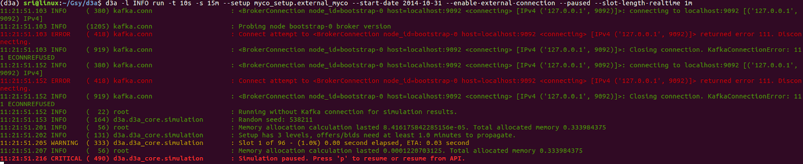

For local test runs of Grid Singularity Exchange (backend simulation), [redis](https://redis.io/){target=_blank} is used as a communication protocol.

###Install Redis server

To install the Redis server, open a new terminal window and type:
```
brew install redis
```
To install redis in Ubuntu follow the instructions in this [link](https://redis.io/topics/quickstart){target=_blank}.
To start the redis instance, open a new terminal and run the following command:

```
redis-server /usr/local/etc/redis.conf
```

The path for the Redis server would be the location where the Redis is installed in your system.

###Install the matching-engine-api-client

1. Make a new virtual environment for the Matching API client:

```
mkvirtualenv gsy-matching-engine-sdk
```

2. Clone the GitHub directory of the Matching Engine client:

```
pip clone git+https://github.com/gridsingularity/gsy-matching-engine-sdk.git
```

3. Install the requirements:

```
pip install - e.
```

###Enabling external connection for clearing the market
To register an asset through API and to use an external matching algorithm it is required to specify the following line in the exchange setup file:
```python
ConstSettings.MASettings.MARKET_TYPE = 2
ConstSettings.MASettings.BID_OFFER_MATCH_TYPE = (BidOfferMatchAlgoEnum.EXTERNAL.value)
```

An example simulation setup can be found here. For more information on how to build this setup and add more markets and assets please visit this page.

###Launch Simulation
Once the entire grid architecture is modeled, including energy assets, the user can launch the simulation by running a command-line including desired setup features:
```
gsy-e -l INFO run -t 10s -s 15m --setup matching_engine_setup.external_matching_engine --enable-external-connection --paused --slot-length-realtime 12
```

After a few seconds, the simulation should begin, waiting for the API template as mentioned in the figure below:



##Initialise and start the API:

The Matching API is launched with a cli command. To launch the Matching API, the user needs to open a new terminal and activate the MatchingEngine-SDK environment:
```
workon gsy-matching-engine-sdk
```
Now, go to the MatchingEngine-SDK directory:
```
cd path_to_directory/gsy-matching-engine-sdk
```
The api launch CLI command takes several arguments that can be listed with:
```
gsy-matching-engine-sdk run --help
```
The arguments are:

   - *base-setup-path* --> Set the base path where the user's client script resides, otherwise, gsy_matching_engine_sdk/setups are taken as default for the user's client scripts. Users can provide either an absolute or a relative file path.
   - *setup* --> Name of user's Matching API module/script.
   - *username* --> Username of the agent authorized to communicate with respective collaboration/CN.
   - *password* --> Password of the respective agent
   - *domain-name* --> GSy-e domain name
   - *web-socket* --> GSy-e WebSocket URI
   - *simulation-id* --> UUID of the collaboration or Canary Network (CN)
   - *run-on-redis* --> This flag targets the local testing of the Matching Engine SDK, where no user authentication is required. A locally running redis server and gsy-e simulation are needed here.


###Interact with local simulations
To interact with a locally running simulation (backend simulation), username, passwords, domain and websocket names and simulation_id are not necessary. There is only an additional flag required in the CLI command : --run-on-redis.
```
gsy-matching-engine-sdk --log-level INFO run --setup matching_api_template --run-on-redis
```

####Log levels:

The API CLI command can receive a _--log-level_ argument. Adjusting this parameter will increase or reduce the level of information displayed in the terminal, while the agent is running. There are 4 levels (classed from low detailed to high:


#####ERROR

Display only critical errors from the Exchange SDK or the Grid Singularity Exchange (for instance, if Grid Singularity Exchange responds with an error in a command that the Exchange SDK is sending, the error log should include it)

#####WARNING

Display non-critical error messages  (for instance if the API agent is over bidding its energy requirement)

#####INFO

Display critical and non-critical errors messages and general information such as market progression and trades

#####DEBUG

Display full information on the agent (for instance all command and response, such as placing bids and offers on the market)
