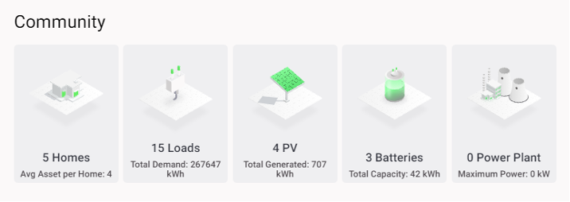

Key Results for the community are shown, detailing self-sufficiency and self-consumption.

***Figure 2.17***. *Key results*

The next results show the total number of energy assets contained within the energy community, categorised according to asset type.

***Figure 2.18***. *Community Assets list.*

The first graphic in bills and traded energy is the Savings KPI, showing how much money has been saved by trading in the local energy community vs. how much would have been paid buying solely from the local utility.

***Figure 2.19***. *Savings KPI for a home with 2 assets*

Each asset also has a key results page, showing a summary of the amount of energy bought or sold and the price of energy.

***Figure 2.20***. *Asset key results for a solar panel*
