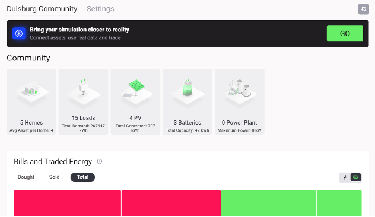
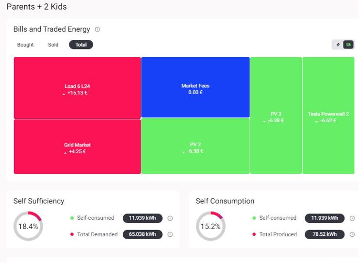

The Results Dashboard illustrates the results of a simulated energy community. It updates while the simulation is running and stored indefinitely until the user decides to delete or to rerun the simulation. The user is able to view Results for each market or asset in the grid configuration.

***Figure 2.14***. *Results Dashboard of a simulated energy community.*

The results automatically load for the community as a whole, however users can see home-specific results by clicking on a home on the map.

***Figure 2.15***. *Results Dashboard for an individual home within a simulated community.*
