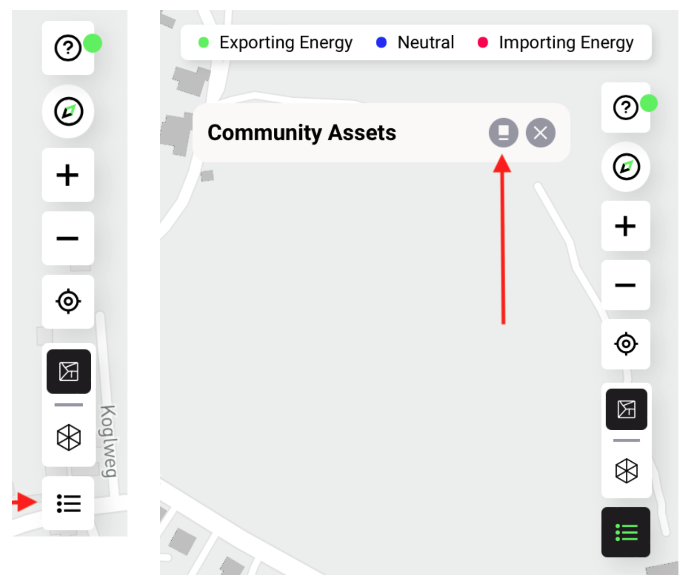
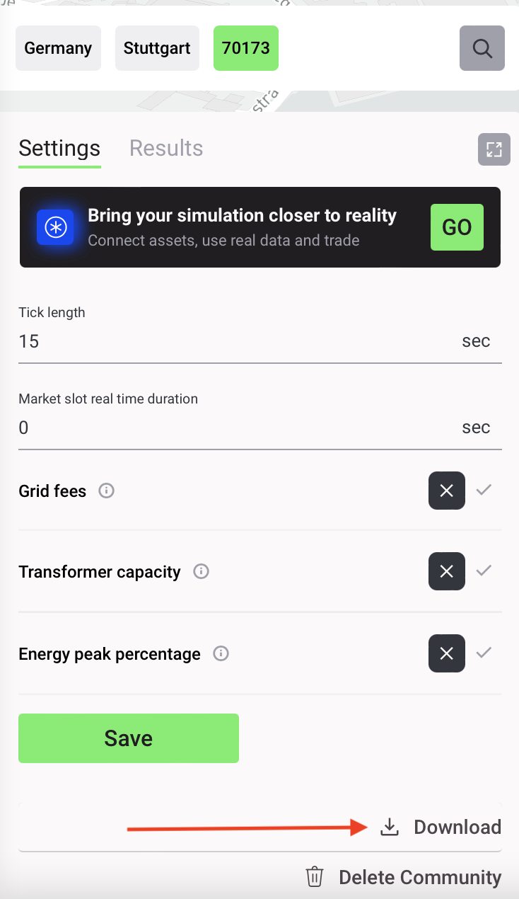

The Results Dashboard illustrates the key performance indicators of a simulated local energy market (LEM or energy community). It updates while the simulation is running and the final outcomes are stored for up to 90 days or until the user decides to delete or to rerun the simulation.

The following results (key performance indicators) are currently available for the LEM simulations in Grid Singularity’s user interface Singularity Map:

- **[Net Energy Traded, Energy Cost (Bill) and Energy Cost Savings](bills_savings.md)**

- **[Self-Sufficiency and Self-Consumption](self-sufficiency-self-consumption.md)**

- **[Carbon Footprint and Carbon Savings](carbon-footprint-savings.md)**

- **[Trade Profile and Energy Peak Percentage](trade-profile.md)**

- **[Aggregate Market Summary](aggregate-market-summary.md)**

- **[Price Graph](price.md)**

- **[Cumulative trades chart and bids and offers graph](trades.md)**

Results are generated for the simulated LEM (energy community), its participants (home/building) and all available energy assets. The results load automatically for the community as a whole, while member-specific results can be viewed by clicking on a select home. The home and asset results can also be retrieved by clicking on the list icon in the bottom right corner and then on the community asset icon that will appear, generating a list of all the homes and assets in that community (see picture below).

<figure markdown>
  {:style="height:350px;width:400px";text-align:center"}
  <figcaption><b>Figure 3.1</b>: Position of button that shows a list of homes and assets in Grid Singularity’s simulation interface (Singularity Map)
</figcaption>
</figure>

The user can also download the results of the simulation for a deeper analysis of the community trading patterns by clicking on the download results icon under the settings tab, as shown in the picture below. For more information about this option, see [Results Download](results-download.md).

<figure markdown>
  {:style="height:550px;width:300px";text-align:center"}
  <figcaption><b>Figure 3.2</b>: Position of button for downloading results in Grid Singularity’s simulation interface (Singularity Map)
</figcaption>
</figure>
