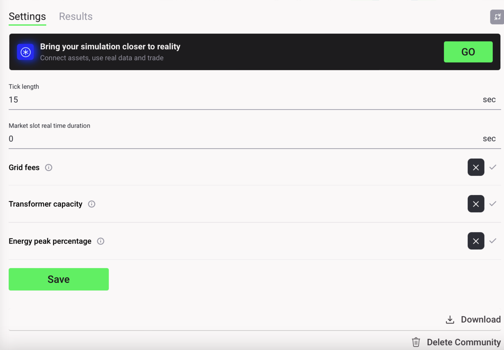

After successfully running a simulation in Grid Singularity’s User Interface, the user can download the results file for a deeper analysis by clicking on “Download” button on the bottom-right corner of the settings tab as shown below:

<figure markdown>
  {:style="height:390px;width:500px;text-align:center"}
  <figcaption><b>Figure 3.15</b>: Settings tab for Grid Singularity’s simulation interface (Singularity Map)</figcaption>
</figure>

An email with a download link is sent to the user's inbox once the results have been compiled in the backend. When the user clicks on the link, they are redirected to the simulation where they click on the “Download” button again to download the results, which are then saved locally on the user's computer. The downloaded folder is organised into two subfolders with relevant files, as follows:

*   **aggregated_results** :
    *   **area_throughput.json** : Imported/exported energy for each market slot :
    *   **Bills.json** : Energy bills of all markets and energy assets (more details [here](bills-traded-energy.md))
    *   **Cumulative_bills.json** : Total energy bills (spent & earned)
    *   **Cumulative_grid_trades.json** : Total energy traded for each market and energy asset and their penalty (for not trading their required energy)
    *   **asset_statistics.json** : asset profiles, energy traded, energy rates (min and max) for each asset each market slot
    *   **Energy_trade_profile.json** : Energy traded in each market
    *   **Kpi.json** : [Self-consumption and self-sufficiency](self-sufficiency-self-consumption.md) (in %), total energy demanded, generated and self-consumed
    *   **Price_energy_day.json** : Min, avg, max and grid fee rates for each market each market slot
    *   **Progress_info.json** : time remaining, simulation duration and percentage completed (if the simulation is complete eta_seconds should report 0 and percentage_completed should report 100)
    *   **Random_seed.json** : Random seed number used in the randomization process for specific events. This can mean the same simulation run multiple times may have slightly different results, as the posting order of bids and offers and matching trades can differ in certain situations (such as when two bids for the same price are randomly selected to be matched with one offer), causing some trades and bills to be different.
    *   **Simulation_id.json** : UUID of the simulation (can also be found in the simulation URL)
    *   **Status.json** : Status of the simulation
    *   **Unmatched_loads.json** : Number of unmatched load per markets reported each market slot
*   **bids_offers_trades** : The folder structure follows the same logic as the simulation’s grid hierarchy. There are three different csv files :
    *   ***_bids.csv** : Lists every bid posted on the relevant market including their volume, rate and buyer’s name
    *   ***_offers.csv** :  Lists every offer posted on the relevant market including their volume, rate and seller’s name
    *   ***_trades.csv** : Lists each traded including their volume, rate, buyer’s and seller’s name
