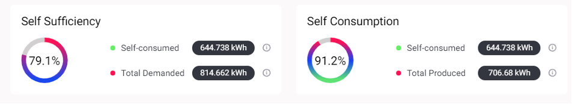

Self-sufficiency rate refers to the share (expressed in percentage terms) of a home’s or community’s energy demand produced (and self-consumed) locally calculated over a defined time frame (weekly or monthly). Self-sufficiency rate is calculated as follows:

`self_sufficiency(market) = self_consumed_energy / total_energy_demanded`

Self-consumption rate refers to the share of energy (expressed in percentage terms) that  the home or the community consumes from its own production calculated over a defined time frame (weekly or monthly).  Self-consumption rate is calculated as follows:

`self_consumption(market) = self_consumed_energy / total_energy_produced`

<figure markdown>
  {:text-align:center"}
  <figcaption><b>Figure 3.5</b>: Example of Self-Sufficiency and Self-Consumption Results in Grid Singularity’s interface (Singularity Map)
</figcaption>
</figure>

Here is an example of the self sufficiency and self consumption rate calculation:

<figure markdown>
  {:text-align:center"}
  <figcaption><b>Figure 3.6</b>: Example setup showing an energy community consisting of two home markets with diverse assets

</figcaption>
</figure>

*   `total_house1_pv_production` = 10kWh
*   `house1_pv` → `house1_load` = 1kWh
*   `house1_pv` → `house1_storage` = 5kWh
*   `house1_pv` → `house2_load` = 4kWh
*   `house1_storage` → `house1_load` = 2kWh
*   `house1_storage` → `house2_load` = 3kWh
*   `house1_self_consumer_energy` = (`house1_pv` → `house1_load`) + (`house1_pv` → `house1_storage` → `house1_load`) = 1 + 2 = 3kWh
*   `house1_total_energy_demanded` (only includes the demanded energy from house1’s load asset) = 3kWh

In this example, self-sufficiency of the house 1 is `self_sufficiency(house1)` = `house1_self_consumer_energy` / `house1_total_energy_demanded`

*   `self_sufficiency(house1)` = 3 / 3 = 1 → 100%

Self-consumption of the house 1 is `self_consumption(house1)` = `house1_self_consumer_energy` / `house1_total_energy_produced`

*   `self_consumption(house1)` = 3 / 10 = 0.3 → 30%

In the **Grid**, the highest level of the hierarchy :

*   **self_sufficiency** = 10 / 10 = 1 → 100%
*   **self_consumption** = 10 / 10 = 1 → 100%
