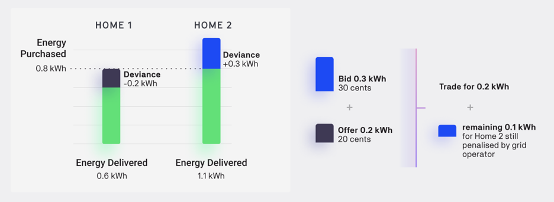

Spot and futures trading requires predictions of energy use at both the asset and network level, which are often associated with high prediction errors. Thus, although a balancing mechanism should deal with the energy imbalances on the physical level, financial exchanges might still not be settled, causing a mismatch between physical energy delivery and market accounting. Some market approaches create orders and matches based on the last 15 minute slot’s energy use (post-delivery, read by smart meters) to solve this problem. Others allow the grid operator to set prices or enforce penalties for any deviance. The Netherlands has implemented a final gate closure time one day after delivery, allowing ex-post trading for balance responsible parties to trade imbalances in real-time. Symbiotic Energy Markets concept allows similar post-delivery trading by all market participants.

Deviations between energy physically produced/consumed and energy purchased in the spot or futures market can be traded post-delivery by submitting a time slot in the past as a requirement attached to a bid or offer, creating a settlement market (figure 3.8). Bids and offers can be matched with a matching algorithm. This allows local deviations to balance without penalty (e.g. a local solar panel that overproduces matches their deviation to a local load that over-consumed), with the remainder filled at a market rate (likely a premium) by individual assets, balancing groups, or grid operators that provided balancing services during delivery. A specific limit may be introduced to represent the time interval in which post-delivery trading can be conducted.

<figure markdown>
  {:text-align:center"}
  <figcaption><b>Figure 4.8</b>: Energy deviations (difference between purchased and delivered energy) can be traded in the settlement market instead of paying a penalty to the grid operator, reducing inefficient accounting. Any remaining deviance can still be penalized by the grid operator.
</figcaption>
</figure>
