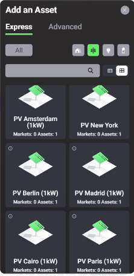
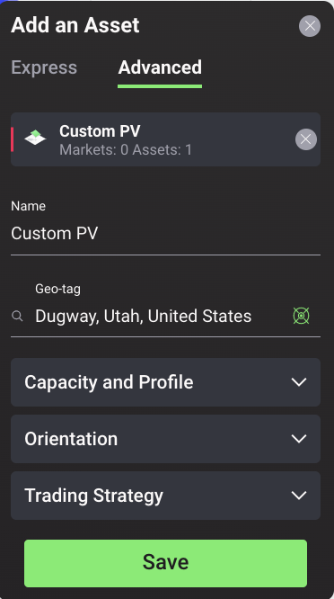
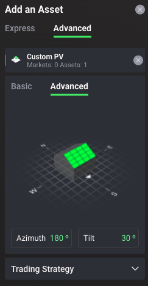
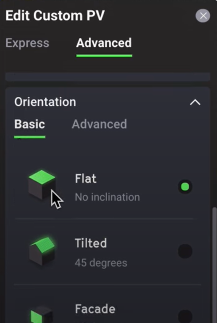

A photovoltaic (PV) module  or  a solar panel is an energy asset that converts solar irradiation into electricity. In the Grid Singularity Exchange, the PV digital twin has been preconfigured to include the DC to AC conversion and represent either a single module, an array of modules or an entire solar park (total capacity can be selected in the advanced PV settings). When modelling energy communities, PVs can be added to homes or, in the case of a shared resource, a community. PVs produce electricity to be self-consumed by the asset owners, sold to another member of the community, sold back to the grid, or stored in a battery for use at a later time, depending on what options are available to the owner in a select market. In the Grid Singularity Exchange user interface (Singularity Map), there are three options to model PV generation. The first option is the Custom PV tool, which allows users to quickly simulate PV generation at a specific location and orientation if an actual PV generation profile is not available. This tool uses the backend code of the [Energy Data Map](https://api.rebase.energy/energy/redoc){target=_blank} provided by [rebase.energy](https://www.rebase.energy/){target=_blank}, and if this service is not available, the PV generation profile is derived from the [Photovoltaic Geographical Information System (PVGIS)](https://joint-research-centre.ec.europa.eu/photovoltaic-geographical-information-system-pvgis_en){target=_blank}. If an exact address-based generation is unavailable, a second option which uses the same tool can be used to upload the city-based synthetic PV profile for that city. The third and most accurate option is for users that have the actual  PV data to upload it by using the ‘upload profile’ option in the custom PV advanced settings.

<figure markdown>
  {:style="height:600px;width:300px";text-align:center"}
  <figcaption><b>Figure 2.9</b>: Express Mode PV Options in the Grid Singularity Exchange web-based interface (Singularity Map)
</figcaption>
</figure>

##PV Configuration Options

###Express Mode
In the express PV configuration mode, the user is provided with a template (synthetic) PV model to include as an asset at a select location in the simulated local energy market by naming the asset and setting its location:

1. Name: select a unique name for the PV;
2. Location: the location selected by the user is automatically uploaded.

###Advanced Mode
In the advanced PV configuration mode, there are settings referring to the Capacity and Profile of the PV and the Trading Strategy as shown in the figure below:

<figure markdown>
  {:text-align:center"}
  <figcaption><b>Figure 2.10</b>: PV Advanced Configuration Options in the Grid Singularity Exchange web-based interface (Singularity Map)
</figcaption>
</figure>

1. Capacity and Profile

    1. Capacity: set the total kW capacity of the PV system
    2. Solar profile: choose one of the following options:
        1. Local generation profile: default setting representing the PV production based on asset location, derived by connecting to the [Energy Data Map](https://api.rebase.energy/energy/redoc){target=_blank} API provided by [rebase.energy](https://www.rebase.energy/){target=_blank} (also termed Custom PV). If this service is not available, the PV generation profile is derived from the [Photovoltaic Geographical Information System (PVGIS)](https://joint-research-centre.ec.europa.eu/photovoltaic-geographical-information-system-pvgis_en){target=_blank} API
        2. City generation profile: synthetic average generation profile for the city, also generated using the Custom PV tool (alternative if address-based location PV generation unavailable)
        3. Upload own / custom generation profile in the form of a [csv file](data-requirements.md).

2. Trading Strategy
    3. Initial selling rate: set the initial (and [consequently the maximum](trading-agents-and-strategies)) rate that the PV offers at the beginning of each market slot in cents/kWh by selecting the [Market Maker](grid-market-settings.md) rate or by entering your own custom rate as ‘user input’
    4. Final selling rate: set the final rate that the PV offers at the end of each market slot in cents/kWh
    5. Rate decrease: enter a value for the explicit rate decrease increment update interval in cents/kWh
    6. Linear pricing: If activated, the rate decrease per amount of time (update interval) is calculated automatically in a way that the price decreases linearly over the market slot time. The rate is calculated starting at the Initial selling rate at the start of the market slot and ending at the Final selling rate at the end of the market slot, while updating the rate at each Update Interval: `energy_rate_decrease_per_update = (initial_selling_rate - final_selling_rate) / max(int((slot_length / update_interval) -1), 1)`; note: you can derive the [bidding behavior](trading-agents-and-strategies)  from a linear fitted curve of a selling rate ranging from initial_selling_rate to final_selling_rate within the bidding interval.
    7. Update interval: set the frequency at which the rate is updated

3. Orientation: If the Local Generation Profile (Custom PV) is selected, the parameters describing the orientation of the solar panels can be set in the basic or advanced mode:
    8. Basic: select Flat, Tilted or Facade orientation
    9. Advanced: enter the tilt and the azimuth values in degrees

<figure markdown>
  {:text-align:center"}
  {style="height:470px;width:280px"; :text-align:center"}
  <figcaption><b>Figure 2.11</b>: Selection of PV orientation in the Grid Singularity Exchange web-based interface (Singularity Map)
</figcaption>
</figure>

The integration of the Energy Data Map API with the Grid Singularity Exchange [Custom PV Tool feature](https://gridsingularity.medium.com/rebase-energy-x-grid-singularity-the-story-of-the-custom-pv-tool-b6224dd1585d)  was designed and developed in the scope of the EU-supported [AI4Cities project](https://gridsingularity.medium.com/grid-singularity-and-rebase-energy-awarded-2021-ai4cities-grant-4e0aa1cf3240){target=_blank}.
