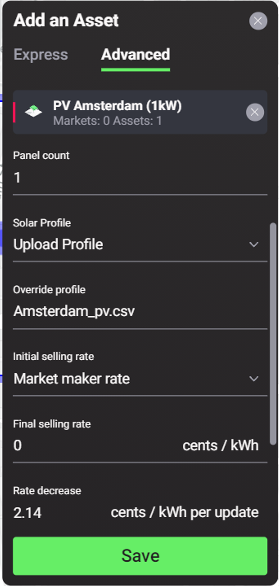

A photovoltaic module (PV) is an energy asset that converts solar irradiation into electricity. In our software, each PV component can represent a single panel, array of panels or an entire Solar park. They can be added to homes or added to a community on their own, with the electricity they produce available for self consumption by the asset owners, sold to another member of the community, sold back to the grid, or stored in a battery for use at a later time, depending on what options are available to the owner. In the Singularity Map, template PV generation profiles from different cities are available to users.  These templates were generated using data from [Energy Data Map](https://energydatamap.com/) and users can choose the PV generation profiles from the options available by selecting the option that is closest to the area they are building their community in, in terms of geography and weather profile. This asset option can be altered to represent everything from a single solar panel to an entire Solar park by changing the panel count in the advanced settings. Users can either add template PV profiles to their homes or communities or they can upload their own PV data by using the ‘override profile’ section in the PV advanced settings, after initially selecting a template PV.

***Figure 2.6***. *The 6 different PV options available to users in the express mode.*

##Asset Configuration Options

***Express Mode***

1. Name - Must be unique
2. Geo-tag - This automatically loads for the location a user selects

***Advanced Mode***

1. Panel count - Users can change the amount of solar panels you want to include in this asset. In this case, 1 panel has a power of 250W.
2. Solar Profile - Users can choose a solar profile template of either sunny, partially cloudy, cloudy, Gaussian, or upload their own custom generation profile.
3. Override Profile -  Users can upload a custom solar profile by providing a [csv file](solar-panels.md).
4. Initial selling rate - Users can choose the initial (and maximum) rate that the PV offers at the beginning of each market slot in cents/kWh. Select the Market Maker rate or create your own custom rate by selecting ‘user input’.
5. Final selling rate - Users can choose the final rate that the PV offers at the end of each market slot in cents/kWh.
6. Rate decrease - Users can enter a value for the explicit rate decrease increment in cents/kWh.
7. Fit to limits - If activated, a rate decrease per time is calculated, starting at Initial Selling Rate and ending at final Selling Rate, while updating the rate at each Update Interval. Users can derive [bidding behaviour](default-trading-strategy.md) from a linear fitted curve of a selling rate ranging from initial_selling_rate to final_selling_rate within the bidding interval. If activated, energy_rate_decrease_per_update = (initial_selling_rate - final_selling_rate) / max(int((slot_length / update_interval) -1), 1)
8. Update interval - Choose the frequency at which the rate is updated.

***Figure 2.7***. *Advanced Configuration options of a Solar Panel.*
