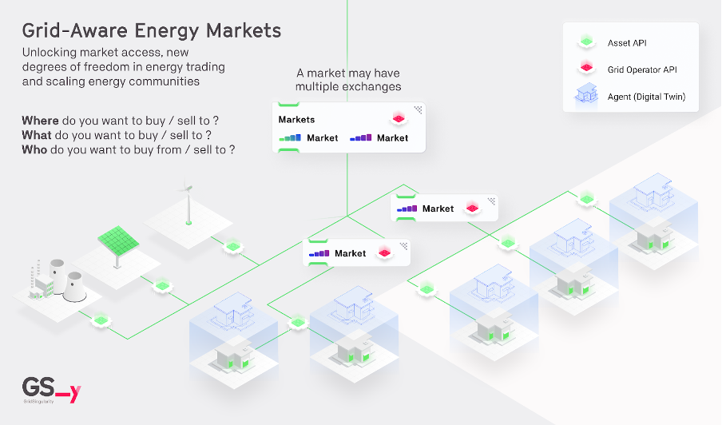
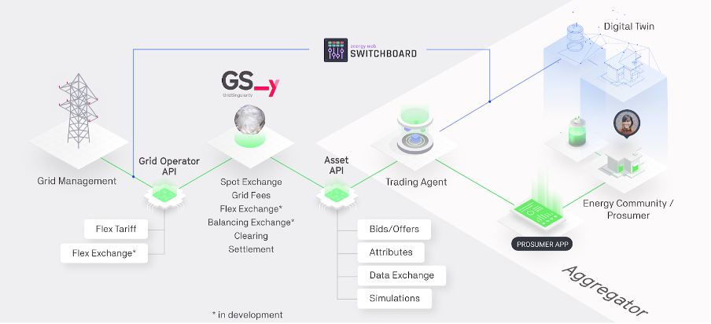

The [Grid Singularity Exchange](https://map.gridsingularity.com/singularity-map){target=_blank} provides software tools, enabling prosumers and consumers organised in (or considering joining) energy communities (also known as energy cooperatives, community choice aggregations or microgrids in different regions of the world), with the support of local companies that facilitate data connectivity to smart metres and energy assets (often local suppliers), to simulate and implement peer-to-peer and community energy trading. While community operation requires real data integration, simulations may also be performed by using historical, forecast or synthetic data. Importantly, our [open source](licensing.md) and modular platform optimises the use of local resources and enables individuals with equitable access to energy trading, at par with large energy suppliers.

Grid Singularity’s [web-based simulation tool](https://map.gridsingularity.com/singularity-map){target=_blank} is currently available to  any user upon free registration. The user can simulate a local energy market ([energy community](community.md)) by configuring a “digital twin” representation of physical grid and energy markets, with household and community assets, such as [consumption assets](consumption.md), [solar panels](solar-panels.md) and [batteries](battery.md), and adding [market information](grid-market-settings.md) (utility price, tariffs and any other pricing information to account for grid cost and integrate external supply for trades that cannot be met locally, as well as the applicable market matching and clearing mechanism and asset trading strategies).  The purpose of creating simulations is to mimic what an energy community might look like, assessing what assets (type and size) best suit the community needs and how activation in local trading affects individual and community energy cost and environmental impact. Existing community members can use it to assess any changes, such as potentially adding storage assets like a battery.

The Grid Singularity [simulation results](results-dashboard.md) can be analysed with the following key performance indicators: self-consumption, self-sufficiency, energy bill value and savings (more in development).  Energy researchers can deploy more advanced simulation features both in the user interface (e.g. use [custom PV tool](https://gridsingularity.medium.com/rebase-energy-x-grid-singularity-the-story-of-the-custom-pv-tool-b6224dd1585d){target=_blank} to integrate solar profiles based on location and weather conditions) and by using the more versatile [open-source, GPL v.3 backend code](https://github.com/gridsingularity/gsy-e){target=_blank} of the Grid Singularity Exchange. Furthermore, live testing of different local energy markets can be enabled by connecting a digital energy community (live data streams from real energy assets) to the [Grid Singularity Test Network](canary-network.md).

The Grid Singularity Medium Channel features several studies that assess the [financial and social benefits of local trading, and the impact of different energy assets](https://gridsingularity.medium.com/modelling-study-to-assess-the-potential-benefits-of-trading-in-and-between-local-energy-d721395ddd4b){target=_blank} and system actions like [applying different grid tariff models](https://gridsingularity.medium.com/energy-singularity-challenge-2020-testing-novel-grid-fee-models-and-intelligent-peer-to-peer-6a0d715a9063){target=_blank}. This wiki provides a detailed guide for prosumers and energy communities to set up a [simulation](community.md), as well as additional guidelines for [asset managers](configure-trading-strategies-walkthrough.md) and [grid operators](implement-grid-fees-walkthrough.md). Accompanying video tutorials can be found [here](https://www.youtube.com/playlist?list=PLdIkfx9NcrQeD8kLBvASosLce9qJ4gQIH){target=_blank}.

***Figure***. *Grid Aware Markets: Trading agents place bids and offers on behalf of assets via the Asset API. Agents trade based on user preferences such as energy source and preferred trading partner. Grid Operators implement dynamic grid tariffs in energy markets through the Grid Operator API.*

Grid Singularity facilitates an individual or energy asset-centred, bottom-up market design by connecting aggregators and grid operators, through an application interface ([Asset API](asset-api-template-script.md) and [Grid Operator API](grid-operator-api-template-script.md), respectively). More specifically, aggregators connect distributed energy assets of a community (including households, businesses and other energy users), while grid operators account for grid costs and access local flexibility for advanced grid management. Connected energy assets are digitally represented by [trading agents](trading-agents-and-strategies) pursuing trading strategies currently based on price but with a capability to be based on more advanced user preferences, such as consuming only renewable energy or trading with a preferred partner, achieving diverse [degrees of freedom](degrees-of-freedom.md).

Assets are typically grouped inside homes based on the owner and trade in a community market. Multiple communities can be connected inside higher markets depending on the geographical reach of the peer-to-peer system and voltage architecture of the grid.

***Figure***. *Grid Singularity Exchange: data flows from energy assets over aggregators and trading agents via APIs for matching. [Energy Web's open source toolkit](https://energy-web-foundation.gitbook.io/energy-web/solutions-2023/data-exchange/use-cases-and-reference-implementations/digital-spine-for-electricity-markets){target=_blank} can be integrated for decentralised asset registry and data access management functionality.*

Grid Singularity’s technical approach includes a decentralised, [Substrate-based](https://substrate.io/){target=_blank} [blockchain implementation](blockchain.md) to advance scalability and security of the exchange (GSy DEX). The [Energy Web Chain](https://www.energyweb.org/){target=_blank} is the blockchain of choice for GSy DEX, anchored upon [Polkadot’s](https://polkadot.network/){target=_blank} scaling solution. Grid Singularity, an energy technology startup, and the Rocky Mountain Institute, a nonprofit clean technology organisation, jointly founded the Energy Web Foundation (EWF) in January 2017 as a non-profit entrepreneurial foundation building web3 applications for the energy transition. Having significantly contributed to EWF development and the launch of the Energy Web Chain, Grid Singularity’s role today in the Energy Web is supervisory and advisory via Foundation Council. Notably, we do not rely on a proof-of-work mechanism of validation and therefore [do not overuse electricity](https://www.greentechmedia.com/articles/read/energy-web-foundation-fix-blockchain-biggest-problem){target=_blank}. Our path to decentralisation and the implementation of Symbiotic Energy Markets is described in the [following discussion paper](https://gridsingularity.medium.com/discussion-paper-grid-singularitys-implementation-of-symbiotic-energy-markets-bd3954af43c8){target=_blank}.

When the Grid Singularity Exchange is deployed as a distributed local energy exchange, the traditional role of the grid operator, which manages the connection to the power grid, and the utility, as a provider of energy, would still continue to be required to integrate the local energy market with the wider grid network. This ensures the reliability of supply in case of a deficit within a community but also export possibilities in case of a surplus. The primary difference is that a utility would no longer be the only market actor with which a household exchanges energy, but one of multiple.

To use the Grid Singularity software to operate an energy community, customisation is required to apply local regulation and a partnership with a local company to enable data connectivity and manage billing and other non-trading operations. In the European Union (EU), this includes ensuring support from a distribution systems operator (DSO) to validate the number of participants and the volume of energy exchanged on the affected distribution grid. Notably, most regions today, including EU member states, allow only community trading with a preset, single community-level price rather than actual peer-to-peer trading. For this reason any operational implementation would be limited to the applicable local trading mechanism, reducing the options and thus also the benefits facilitated by the Grid Singularity software tools.

Grid Singularity fosters interoperability and open-source development, collaborating with other market actors that provide grid management and asset aggregation services and supporting complementary services such as data and smart trading algorithm that further enhance the efficiency of local energy markets (LEM), optimising the use of local renewable resources and other individual and community benefits.

Grid Singularity’s Exchange is a highly innovative and effective grid modernisation solution.

1. First, it empowers customer engagement and provides utmost **[degrees of freedom](degrees-of-freedom.md)** in energy markets enhancing individual and community choices (e.g., type of energy consumed or preferred trading partner), lowering barriers and creating incentives for all participants.
2. Second, it creates a **resilient market** by ensuring equal access, transparent pricing, and trading at optimal market levels (i.e., between assets and buildings or facility and grid).
3. Third, it **incentivizes and facilitates** the integration of clean distributed energy resources (DERs) onto the grid closer to load centers.
4. Fourth, grid operators can use it to **implement flexible grid tariffs** to benefit from the local market flexibility to alleviate congestion.
5. Fifth, the [Grid Singularity API](grid-operator-api-template-script.md) provides instantaneous granular data to the grid operator–which historically has relied upon changes in detected load and alterations from the forecast–enabling the operator to improve management, flexibility, and grid performance.
6. Sixth, peer-to-peer trading is **market-driven**, not based upon predetermined pricing, which optimizes local consumption and thus the use of (cheaper) local renewables, increasing affordability, reducing reliance and overall/peak load on the grid, supporting efficient asset utilization, and reducing system losses.
7. Seventh, it **increases community self-sufficiency and energy savings**, providing emergency power backup, and mitigating the need for new transmission infrastructure.
8. Finally, the peer-to-peer trading system **incentivizes private investment** in electric system infrastructure by increasing revenue from renewable DERs and providing decision-making tools.
