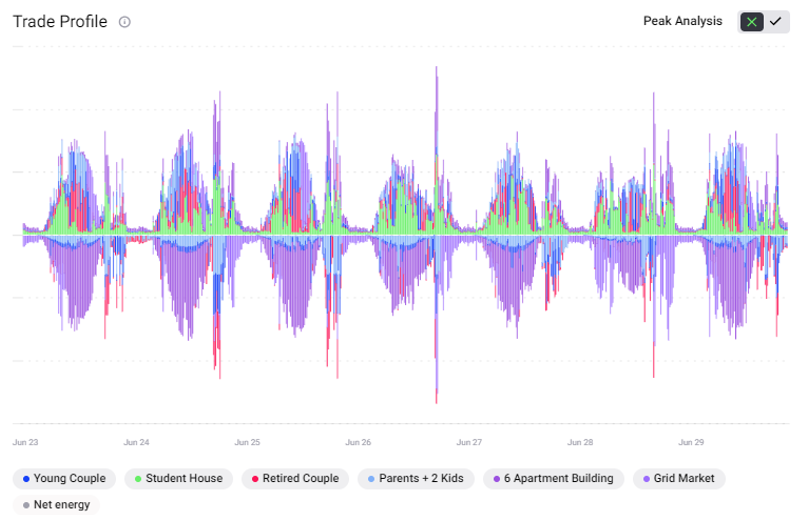
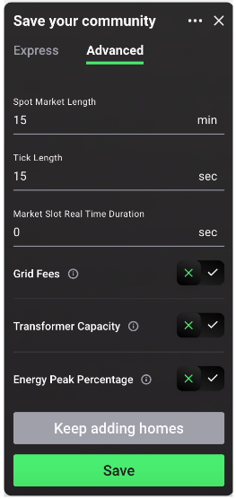
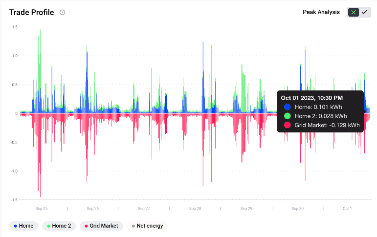
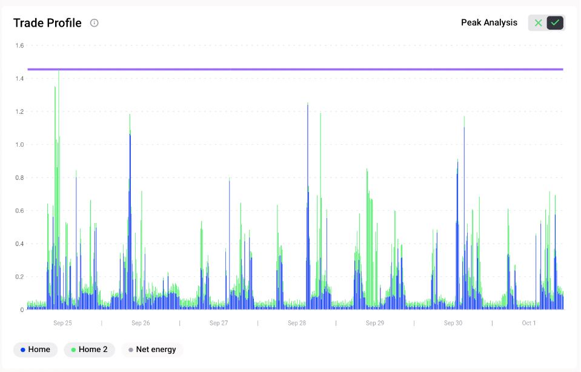

The trade profile shows the energy traded in kilowatt hours (kWh) in the respective market (home market or community market) per 15-minute market slot over a defined time frame (weekly or monthly). The negative side of the y-axis shows the energy sold, and the positive y-axis the energy bought. Different colours represent different market participants (energy assets and homes). Users can view the trade profile of any of the individual homes or the overall local energy market in this chart, including the net energy flow, by clicking on the legend below the graph. As all trades between buyers and sellers are accounted for in a select market, the supply and demand sides which are represented by the negative and positive sides of the y-axis respectively are exact mirrors of each other in terms of volume of energy in kWh.

<figure markdown>
  {:text-align:center"}
  <figcaption><b>Figure 24</b>: Trade profile chart example showing energy traded for all local energy market participants and the external energy supplier (the grid market) in the Grid Singularity’s simulation interface (Singularity Map).
</figcaption>
</figure>

The energy peak percentage calculation is a tool that compares the current energy peak to a baseline. It can be switched on/off by selecting the 🆇 or ✅ button at the bottom of the advanced community settings tab as shown in the figure below.

<figure markdown>
  {:text-align:center"}
  <figcaption><b>Figure 25</b>: Enabling energy peak percentage metric in the advanced community settings tab in the Grid Singularity’s simulation interface (Singularity Map)
</figcaption>
</figure>

The energy peak imports/exports is the maximum value of the aggregate imports/exports of a respective asset or community calculated over a defined timeframe (weekly or monthly). The user is able to set a baseline peak energy import in kWh and a baseline peak energy export in kWh that they may have gotten from another simulation in order to calculate the energy peak percentage, which is a  measure of how much the peak imports or exports have changed between a baseline defined in market settings and the simulation.The purpose of the energy peak percentage value is to assess the impact of applied grid fees or different energy storage strategies on the peak imports and exports of a market.

<figure markdown>
  {:text-align:center"}
  <figcaption><b>Figure 26</b>: Configuring community’s baseline peak imports and exports in the Grid Singularity’s simulation interface (Singularity Map)
</figcaption>
</figure>

On the energy peak analysis plot, two lines are shown: the current peak imports (at top) and the current peak exports (at bottom), representing the maximum energy imported and exported for the selected market.

Once the simulation has finished running, the energy peak percentage calculation can be visualised or removed by clicking the  ✅ (on) or 🆇 (off) button located in the  top right corner of the chart as shown in the figure below:

<figure markdown>
  {:text-align:center"}
  <figcaption><b>Figure 27</b>: Trade profile chart example without energy peak percentage visualisation in the Grid Singularity’s simulation interface (Singularity Map)
</figcaption>
</figure>

When activated, only the net external trades of each participant are displayed. The net energy displays the difference between the total import and export for each market slot, useful in understanding the impact to transmission capacity.

<figure markdown>
  {:text-align:center"}
  <figcaption><b>Figure 28</b>: Trade profile chart example with energy peak percentage visualisation in the Grid Singularity’s simulation interface (Singularity Map)
</figcaption>
</figure>

The energy peak percentage value is available in backend and can be calculated manually as follows:

`Import_peak_percentage = (import_peak_energy_kWh / import_baseline_peak_energy_kWh) * 100`

`Export_peak_percentage = (export_peak_energy_kWh / export_baseline_peak_energy_kWh) * 100`

If the energy peak percentage is **below 100%**, the peak was **reduced** vs. the baseline. The energy peak was **increased** if the energy peak percentage value was above **100%**.
