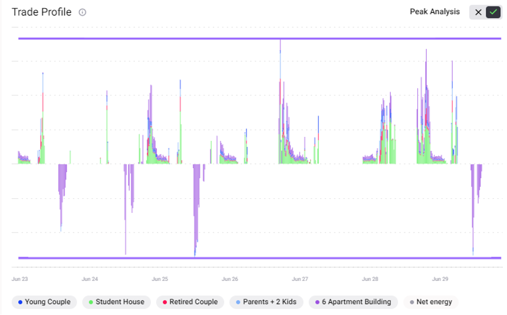
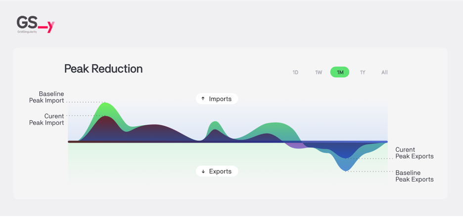

The trade profile shows the energy traded in kWh in this market (community or homes) per 15 minute market slot for the duration of the simulation. The negative side of the y-axis represents the energy sold, and the positive y-axis shows the energy bought. The different colors represent the different market participants (energy assets and markets). Users can show/hide the trade profile of any of the individual homes or grid market in this chart by clicking on it’s profile beneath it, including the net energy flow. As all buyers and sellers of each trade are accounted for in a select market, the supply and demand sides are exact mirrors of each other in terms of volume.

***Figure 2.24***. *Trade Profile Results Chart showing results for all homes in this community and the grid market.*

The peak analysis is an advanced tool that compares the current energy peak to a baseline configured in the market settings. It can be switched on/off by selecting the 🆇 or ✅ buttons to the top-right of the chart.

***Figure 2.25***. *Peak Analysis applied to the Trade Profile Results Chart.*

When activated, only the net external trades of each participant are displayed. The net energy displays the difference between the total import and export for each market slot, useful in understanding the impact to transmission capacity.

The energy peak imports/exports is the maximum value of the aggregate imports/exports of each asset inside a market. The user is able to set a baseline peak energy import in kWh and a baseline peak energy export in kWh that they may have gotten from another simulation in order to calculate the energy peak percentage, which is a  measure of how much the peak imports or exports have changed between a baseline defined in market settings and the simulation. The purpose of the Energy Peak Percentage value is to assess the impact of applied grid fees or different energy storage strategies on the **peak imports** and **exports** of a market.

***Figure 2.26***. *Peak imports and exports of a market.*

It is calculated as follows:

`Import_peak_percentage` = `import_peak_energy_kWh` / `import_baseline_peak_energy_kWh` * 100

`Export_peak_percentage` = `export_peak_energy_kWh` / `export_baseline_peak_energy_kWh` * 100

If the energy peak percentage is **below 100%**, the peak was **reduced** vs. the baseline. The energy peak was **increased** if the energy peak percentage value was **above 100%**.

On the peak analysis plot, two lines are shown: the current peak imports (at top) and the current peak exports (at bottom), representing the **maximum** energy imported and exported for the selected market.
