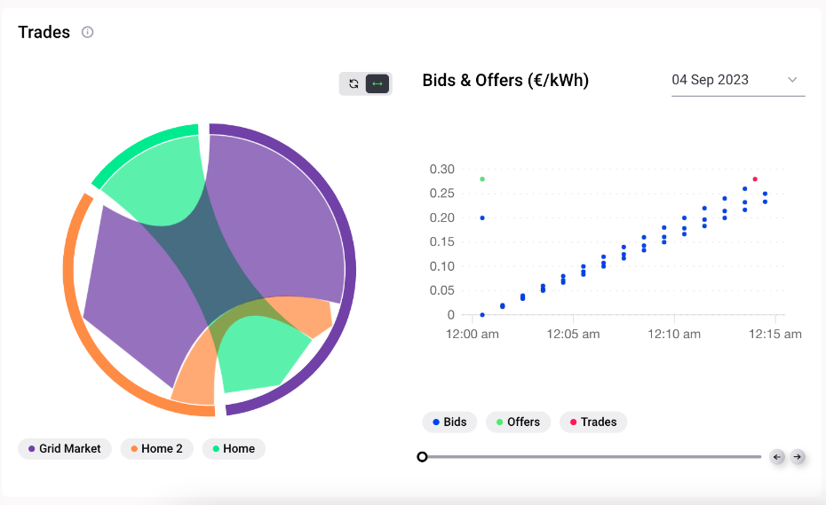

The cumulative trades chart on the left in the figure below shows the amount of energy which was traded between each of the homes (representing households and other energy community participants) and the external suppliers (grid market) in kWh. The trades can be filtered by cumulative or per market slot or by clicking to view an individual home in the chart.

In the graph on the right, each bid, offer and trade posted/cleared in the selected market is shown according to its posting/clearing times, allowing the user to analyse how specific offers/bids were or were not matched and validate or further investigate their trading strategy. The x-axis of this graph is the market slot length (15 minutes by default), and the y-axis shows the bid and the offer price. Each market slot of the simulation can be selected and viewed with the drop down function (days) and the slider (hours & minutes).

<figure markdown>
  {:text-align:center"}
  <figcaption><b>Figure 3.14</b>: Trades shown in cumulative form (left) and per market slot (right) in the Grid Singularity’s simulation interface (Singularity Map)
</figcaption>
</figure>
