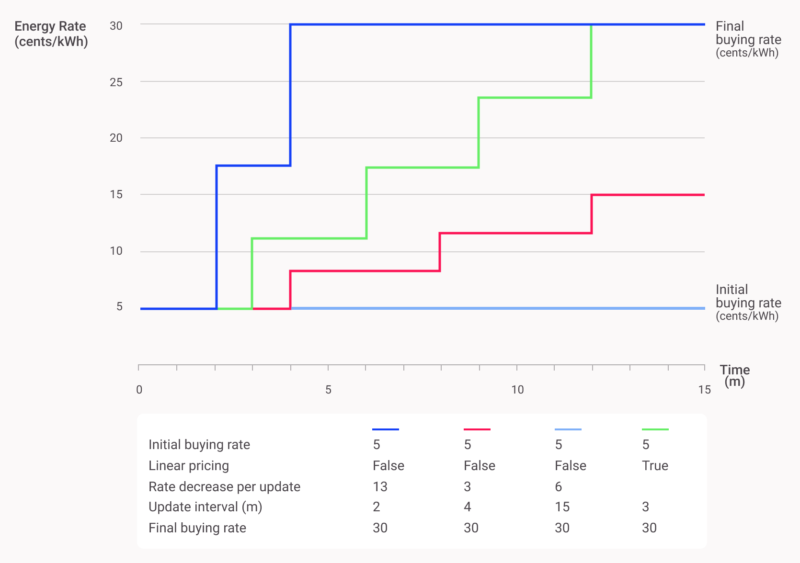

### Trading agents and bids/offers process in hierarchical market structure

The Grid Singularity Exchange includes integrated trading strategies for all supported assets, enabling automated asset trading without any intervention from the asset owner.
These  trading strategies are deterministic. Each consuming asset will first try to buy energy at a low price and, if not cleared, the price will increase linearly during the market slot until a user-set maximum is reached. In turn, assets generating energy will try to sell at a high price first and, if not cleared, reduce their rate linearly until a user-set minimum is reached.

In addition to asset trading strategies, another important component for the definition of the grid topology is the Market Agent. Contrary to asset trading strategies, which are associated with energy assets, the Market Agents are associated with electricity grid components (e.g. voltage transformers) and/or separate segments of the electricity grid (e.g. medium voltage grid of a geographical area).  The Market Agent is responsible for maintaining the grid topology and determining the market hierarchy in the Grid Singularity Exchange, managing trading within and among different segments of the grid.To facilitate communication among different markets, each Market Agent maintains a reference to the markets that are above and below in the grid hierarchy,  enabling each market to progressively propagate their bids and offers across the entire grid.
Its main functionalities are the following:

* Forwarding bids and offers from a lower hierarchy (market) to an upper hierarchy (market),
* Reacting to bids, offers and trades reported by other Market Agents in connected markets, in order to propagate the event for the forwarded offer/bid, and
* Triggering the matching of bids and offers for the two-sided market.

To prioritise local trades, Market Agents forward bids and offers to higher/lower markets with a [two-tick](market-types.md#market-ticks) delay.

In addition to Market Agents, the Grid Singularity Exchange relies on two additional types of agents: the Grid Agent and the Asset API Agent. The Grid Agent is responsible for the connection of the community to the grid (for more, see the [Grid Data API](get-simulation-data.md#grid-data-api) section), and  the Asset API Agent represents physical assets, which have their own trading strategies, which are described in further detail below. Finally, the balancing market relies on a version of a Market Agent termed the [Balancing Agent](market-types.md#balancing-market-structure).

The following illustration shows a sample grid setup and the role of the Market Agent in the market hierarchy in the Grid Singularity Exchange during one time slot:

<figure markdown>
  {:text-align:center"}
  <figcaption><b>Figure 3.1</b>: Market Agents and bids / offers propagation in the Grid Singularity Exchange.
</figcaption>
</figure>

### Bid/Offer Attributes and Requirements for Trading Preferences (Degrees of Freedom)

Bids and offers for energy include a set of attributes (e.g. encrypted unique asset ID, asset location, type of energy produced e.g. solar energy) and diverse requirements that reflect trading preferences (termed degrees of freedom), such as energy quantity, price range, energy source, geographic distance, or preferred trading partner.

Intelligent agents make algorithmic trading decisions on behalf of participating energy assets, translating energy asset information and individual trading preferences into a _requirements_ function. Bids and offers are submitted through Grid Singularity’s [Asset API](configure-trading-strategies-walkthrough.md), modified to include attributes and requirements for each submitted order. Each market then stores the list of attributed bids and offers in the exchange’s open order book to be matched.

An example of a bid and offer with attributes and requirements is shown in the figure below. The bid submits three sets of conditions. As the second condition is fulfilled by the offer, the two orders are successfully matched, in this case for 0.8 kWh of photovoltaic (PV) energy (at a price between 21 and 25 cents as determined by the matching algorithm). A verification function performs this check. The function accepts a bid / offer pair as input, returns a <True> (green check) if there is a valid match, and returns a <False> (red x) if requirements are not met. If the function returns <True>, a trade is created. In a near-term centralised implementation, this verification function is integrated into the exchange code. In a [blockchain implementation](blockchain.md), it is to be deployed as a module of the parachain’s protocol.

<figure markdown>
  {:text-align:center"}
  <figcaption><b>Figure 3.2</b>: Example of a bid and offer with attributes and requirements.
</figcaption>
</figure>

### Asset Trading Strategies

Generation assets can select one of five trading settings when posting market offers:

*  initial_selling_rate
*  final_selling_rate
*  update_interval
*  energy_rate_decrease_per_update
*  linear_pricing

The following plot shows the changing energy rate in a spot market slot (slot_length = 15 min) for the first four trading settings of an example PV asset.

<figure markdown>
  {:text-align:center"}
  <figcaption><b>Figure 3.3</b>: Four different trading settings of an example PV asset in a spot market slot (slot_length = 15 min).
</figcaption>
</figure>

If the fourth trading setting is selected and linear_pricing set to `True`, `energy_rate_decrease_per_update` is ignored and a rate decrease per time is calculated, starting at initial_selling_rate and ending at final_selling_rate while updating the rate at each update_interval.

Similarly, consuming assets (loads and/or storages) can select of the following five trading settings when posting bids:

* initial_buying_rate
* final_buying_rate
* update_interval
* energy_rate_increase_per_update
* linear_pricing

The following plot shows the energy rate change in a spot market slot (slot_length = 15 min) for the first four trading strategies of an example load asset. If the fifth trading strategy is selected and linear_pricing set to True, energy_rate_increase_per_update is ignored and a rate increase per time is calculated that starts at initial_buying_rate and ends at final_buying_rate while updating the rate at each update_interval.

<figure markdown>
  {:text-align:center"}
  <figcaption><b>Figure 3.4</b>: Four different trading settings of an example PV asset in a spot market slot (slot_length = 15 min).
</figcaption>
</figure>

Assets can also deploy more intelligent trading strategies, as demonstrated in the 2020 Energy Singularity Challenge, described in the following two articles:

* Grid Singularity. (September 10, 2020). [En Route to Energy Singularity Odyssey Momentum: Learnings from the 2020 Chaos Experiment](https://gridsingularity.medium.com/en-route-to-energy-singularity-odyssey-momentum-learnings-from-the-2020-chaos-experiment-8dc38ff26869){target=_blank}
* Grid Singularity. (November 25, 2020). [Energy Singularity Challenge 2020: Social Energy Networks](https://gridsingularity.medium.com/energy-singularity-challenge-2020-social-energy-networks-157b390e5f39){target=_blank}

Information on how to set up and train intelligent trading strategies through the Grid Singularity Asset API is available [here](configure-trading-strategies-walkthrough.md).
