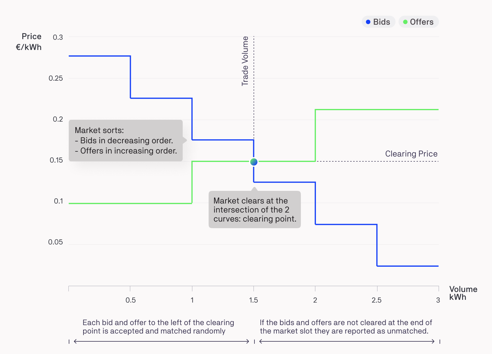

In the Two-Sided Pay-as-Clear market, buyers are able to place bids in the market alongside the offers placed by sellers.

The market collects and matches bids and offers issued by trading agents, and dispatches bids and offers to other markets via the MarketAgent (MA). Bids and offers can also be annulled by the trading agent. Market Agents are created and operated by each market (area) [to forward bids and offers to the connected markets](market-agent.md).

Currently, there is a merit-order-effect mechanism implemented for bid and offer matching where bids and offers are aggregated and cleared in a specified clearing interval. At the end of each interval, bids are arranged in a descending order, offers in an ascending order and the equilibrium quantity of energy and price is calculated. The clearing point (the quantity of energy that is accepted **trade volume** for a specific energy rate **clearing price**) is determined by the point where the arranged bid curve for the buyers drops below the offer curve for the sellers.

<figure markdown>
  {:text-align:center"}
  <figcaption><b>Figure 4.3</b>: Two-Sided Pay-as-Clear Market mechanism.
</figcaption>
</figure>

The highest bids are matched with the lowest offers. The matching rate is the clearing price (cents/kWh). The remaining bids and offers (right of the clearing point in the plot above) are not cleared at this clearing point and remain in the market for later matching.
