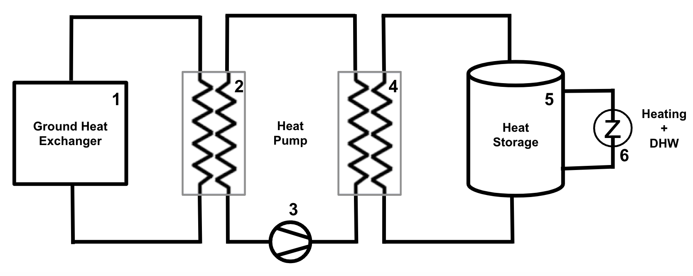

# Virtual Heat Pump
## Virtual Heat Pump Model

A Virtual Heat Pump (VHP) is akin to a digital twin representing the district heating system role in the electricity market, simulating how the demand for electricity that is satisfied by district heating could be satisfied if a heat pump were used instead. This allows for a comparison of the costs and benefits of the two alternatives, including an assessment on the impact on the grid stability by potentially adding heat pumps to the system. Finally, it facilitates the sizing optimization (selection of the model, the rating or other nameplate parameters) of the heat pump if there is a consideration to replace the district heating connection. The modelled trading strategy assumes that the district heating network connection would be replaced by a ground source heat pump, which includes a water tank storage (reference model illustrated in the figure below). The heat pump is modelled in its entirety as a single system and not as separate units; therefore, the condenser and the compressor are both accounted for in the electricity demand. Other VHP configuration parameters can be modified to suit a particular use case, as described in detail in the [Virtual Heat Pump Code Configuration](assets-installation.md#virtual-heat-pump-code-configuration).

<figure markdown>
  
  <figcaption><b>Figure 2.29</b>: Ground source virtual heat pump diagram
</figcaption>
</figure>

The heat pump operation steps are the following:

1. Heat from the water pipes (boreholes) in the ground (#1 in Figure 2.29) is transferred to the source side of the heat pump, via the heat exchanger (evaporator) (#2 in Figure 2.29)
2. The heat pump compressor (#3 in Figure 2.29) increases the pressure and the temperature of the gas medium.
3. The heat from the condenser side of the heat pump is transferred to the water tank storage via the second heat exchanger (#4 in Figure 2.29) and the gas medium is cooled and converted to liquid (condensed).
4. The water tank storage (#5 in Figure 2.29) temperature is increased as a result of the heat produced by the heat pump condenser in step #3.
5. Heat from the water tank storage is used in order to provide the heat demand of the building (#6 in Figure 2.29).

Unlike the heat pump model described above, district heating networks use water pipes that are directly connected to the building, and usually the supply temperature, return temperature and water flow rates are measured in order to facilitate customer billing. The virtual heat pump model can use these district heating measurements to calculate the heat demand of the building.  The heat demand is then provided as an input for the VHP model to calculate the energy that needs to be consumed by the heat pump in order to provide the heat demand, taking into account the flexibility that the water tank storage provides.

## Virtual Heat Pump Model Equations

The model of the virtual heat pump comprises a set of mathematical equations that each simulates a different component of a heat pump system. The system of linear equations is optimised, in order to define the state and operation of the simulated heat pump. The optimisation parameter of the proposed model is the target temperature of the storage. The system is allowed to monitor the current temperature of the storage, and aims to achieve a target storage temperature that is bounded by the limitations of the minimum and the maximum temperature of the water tank.

The output of the proposed model is the calculation of the electricity consumption of the heat pump $P_{el-hp}$, which can be used for this asset to participate in the energy market, while incorporating the flexibility provided by the water tank storage. The electricity consumption, which is related to a supplied heat $Q_{hp_{out}}$ and COP, is calculated based on the following equation:

$$Q_{hp_{out}} = P_{el-hp} * COP \tag{1}$$

The electricity consumption of the heat pump is upper-bounded by the maximum power consumption of the heat pump:

$P_{el-hp} <= P_{el-hp-max}$

The assumption is that the losses from the heat exchanger between the heat pump and the storage are ignored, and that the heat supplied by the heat pump to the storage is roughly equivalent to the heat generated by the heat pump itself: $Q_{in} \small  \cong Q_{hp_{out}}$ resulting in

$$Q_{hp_{out}} = P_{el-hp} \cdot COP = Q_{in} \tag{2}$$

The $COP$ at each time-slot will be calculated as

$$ COP= \eta T_{condenser} / (T_{condenser} - T_{source}) \tag{3}$$

Where:

  * $\eta$ is the empirical calibration coefficient for water-to-water heat pumps
  * $T_{source}$ is the district heating supply temperature
  * $T_{condenser}$ is the condenser (or sink) temperature

The formula is based on the Carnot equation, with the default calibration coefficient of η=0.6 selected based upon a literature review of different COP formulations. This coefficient can be changed in the backend code.

A required input for solving the preceding equations is the amount of heat generated by the heat pump ($Q_{hp_{out}}$), and it needs to be associated with the water tank model (since the heat generated by the heat pump is used exclusively to increase the water tank temperature and provide the heat demand of the home - the main input of our model). The underlying premise is that the heat input to the water tank should be equal to the heat that is extracted from the water tank to cover the heat demand of the building, plus the extra heat stored in the water tank. This relation is reflected by the following equation for the market slot $i$:

$$Q_{in, i} - Q_{out,i} - Q_{loss,i} = \rho_i V_i C_p \cdot \frac{dT_i}{dt} \tag{4}$$

Where:

  * $Q_{in, i}$ is the heat generated by the heat pump, i.e. the added heat to the water tank storage
  * $Q_{out,i}$ is the heat demand of the building, i.e. the heat extracted from the water tank storage
  * $Q_{loss,i}$ is the heat loss due to the water tank storage (ignored by the current model)
  * $\rho_i$ ρi  is the water density (constant, $1 kg/l$)
  * $V_i$ is the water tank volume (in $l$)
  * $C_p$ is the water specific heat capacity (constant, $4182 J/kg°C$)
  * $\frac{dT_i}{dt}$ is the temperature derivative (in $°C/sec$)

The temperature derivative is calculated as the temperature difference between (i) the target temperature of the water tank storage ($T_{storage-target}$, in Celsius, used as the optimization variable of the system, providing the flexibility to the heat pump operation) and (ii) the current temperature of the water tank storage ($T_{storage-current}$ in Celsius), divided by the measurement duration ($t_{measurement}$), in seconds; has to be equal to the market slot duration):

$$\frac{dT_i}{dt} = (T_{storage-target} - T_{storage-current}) / t_{measurement} \tag{5}$$

The $Q_{out,i}$ can be calculated using the following equation:

$$Q_{out,i} = \dot{m}_{DH} C_p (T_{s,i} - T_{r,i}) \tag{6}$$

Where

  * $\dot{m}_{DH}$ is the district heating water flow (in $kg/sec$)
  * $C_p$ is the water specific heat capacity  (constant, $4182 J/kg°C$)
  * $T_{s,i}$ and $T_{r,i}$ are the district heating supply and return temperatures (in $°C$) respectively.

The $Q_{in,i}$ can be calculated using the following equation:

$$Q_{in,i} = \dot{m} C_p (T_{condenser} - T_{storagemean}) \tag{7}$$

Where:

  * $\dot{m}$ is the water flow to the tank (in $kg/sec$)
  * $C_p$ is the water specific heat capacity  (constant, $4182 J/kg°C$)
  * $T_{condenser}$ is the HP condenser setpoint, to be defined by the optimizer each time step. $T_{condenser}$ is the maximum allowed and not set to a constant value. As an optimization variable input to the system, this value will be changing from the condenser temperature required for the water tank to reach its maximum temperature, to the condenser temperature required to maintain the current temperature, depending on the energy that the heat pump traded / consumed.
  * $T_{storagemean}$ is the volume-averaged water tank storage temperature at the start of the market slot (in $°C$)

The system of equations 4, 5, 6, 7 is calculating the value of the condenser temperature ($T_{condenser}$) by using the target storage temperature as the optimization parameter ($T_{storage-target}$). The calculated condenser temperature is then used by equation 3 in order to calculate the $COP$ ,  which in turn is used in conjunction with $Q_{in,i}$ in equation 2 in order to finally calculate $P_{el-hp}$.
